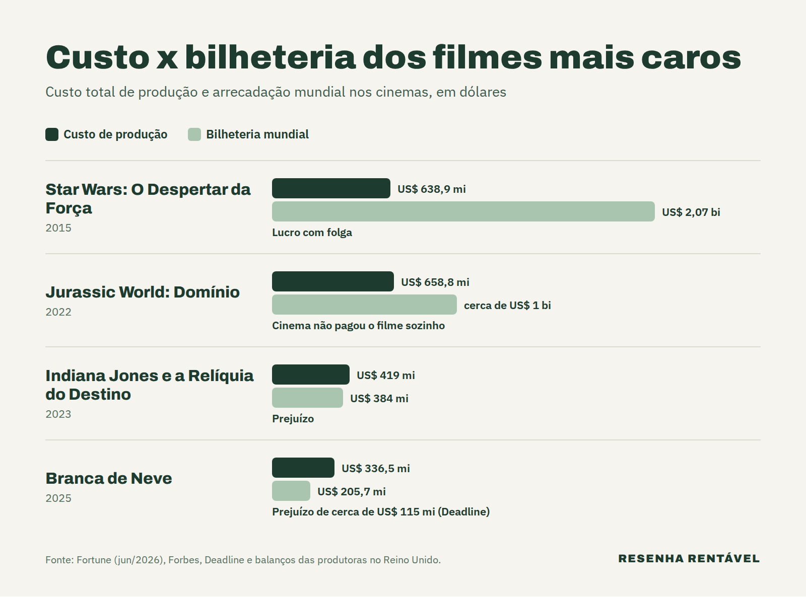

Os filmes mais caros da história passaram da marca de US$ 600 milhões de custo, e nem todos devolveram o dinheiro. Segundo balanços entregues ao governo britânico e analisados pela [Fortune](https://fortune.com/2026/06/17/most-expensive-movie-ever-jurassic-world-dominion-beating-star-wars-the-force-awakens/), o recorde é de Jurassic World: Domínio (2022), com US$ 658,8 milhões gastos. Logo atrás aparece Star Wars: O Despertar da Força (2015), com US$ 638,9 milhões.

Durante décadas, o custo real de um filme foi segredo de estúdio. Os números divulgados na época do lançamento costumavam ser estimativas, quase sempre bem menores. Isso mudou porque as produções filmadas no Reino Unido recebem um incentivo fiscal do governo local e, em troca, precisam publicar balanços detalhados. Com isso, jornalistas passaram a somar cada centavo, e o ranking das maiores produções de Hollywood ganhou números novos em junho de 2026.

## Quais são os filmes mais caros da história?

O topo da lista pertence a duas franquias. Jurassic World: Domínio lidera com US$ 658,8 milhões, seguido por Star Wars: O Despertar da Força, com US$ 638,9 milhões. Em terceiro lugar vem outro dinossauro: Jurassic World: Reino Ameaçado (2018), que custou US$ 606,3 milhões, de acordo com a mesma reportagem da Fortune.

A saga Star Wars aparece de novo com A Ascensão Skywalker (2019). Segundo a [Forbes](https://www.forbes.com/sites/carolinereid/2023/02/26/star-wars-the-force-awakens-becomes-the-most-expensive-movie-in-history/), o episódio final da trilogia gastou US$ 503,6 milhões. Em comum, todos esses filmes foram rodados em estúdios britânicos, por isso as contas vieram a público.

Vale entender uma diferença importante. O valor total é quanto a produção gastou. O custo líquido é o que sobra depois do reembolso do governo britânico, que devolve parte do dinheiro gasto no país. No caso de Domínio, a devolução foi de US$ 127,8 milhões, e o custo líquido ficou em US$ 531 milhões.

## Por que Jurassic World: Domínio custou tanto?

A resposta tem nome: pandemia. O filme foi gravado em 2020, no auge da covid-19, e a Universal precisou adotar protocolos de segurança caros. Além disso, as filmagens pararam por meses, mas os cenários continuaram montados, com equipe e segurança pagas para manter tudo de pé.

Segundo a Fortune, o estúdio ainda pagou quarentena para o elenco num hotel britânico com diárias de mais de US$ 600. Somado, cada atraso virou milhões de dólares extras. Por isso, Domínio tirou de Star Wars o posto de filme mais caro já feito.

## Os filmes mais caros da história deram lucro?

Para responder, é preciso saber como a bilheteria é dividida. O estúdio não fica com tudo que o público paga no cinema. Em geral, os cinemas ficam com uma parte grande, e a Fortune calcula que a Universal recebeu cerca de 50% da bilheteria de Domínio. Além disso, a campanha de divulgação costuma custar dezenas de milhões de dólares, e esse gasto não entra no custo de produção.

Com essa conta, O Despertar da Força é o caso de sucesso absoluto. O filme arrecadou US$ 2,07 bilhões no mundo, uma das maiores bilheterias da história (atrás só de nomes como [Avatar, o filme de maior bilheteria da história](https://resenharentavel.com/filme-de-maior-bilheteria-da-historia/)), valor muito acima do que custou. Domínio, por outro lado, fez cerca de US$ 1 bilhão. Assim, a fatia da Universal ficou perto de US$ 500 milhões, abaixo do custo líquido de US$ 531 milhões. Na prática, o cinema sozinho não pagou o filme, e o resultado dependeu de outras receitas, como streaming, TV e produtos licenciados.

## Quais filmes caros deram prejuízo?

Indiana Jones e a Relíquia do Destino (2023) é o exemplo mais citado. A produção gastou US$ 419 milhões, ou US$ 352,3 milhões depois do reembolso britânico. No entanto, a bilheteria mundial ficou em US$ 384 milhões. Segundo cálculo da Forbes, o filme precisaria arrecadar US$ 477,8 milhões só para a Disney empatar nos cinemas.

Branca de Neve (2025) seguiu o mesmo caminho. O remake custou US$ 336,5 milhões, ou US$ 271,6 milhões em valor líquido, e fez US$ 205,7 milhões no mundo. Por isso, a [Deadline](https://deadline.com/2025/03/snow-white-bombs-rachel-zegler-1236354912/) estimou um prejuízo de cerca de US$ 115 milhões para o estúdio. Em outras palavras, gastar muito não garante público, e o risco cresce junto com o orçamento.

## Por que Hollywood continua gastando tanto?

A lógica é a das franquias. Um filme de uma marca conhecida atrai público no mundo inteiro, vende brinquedos, alimenta parques temáticos e gera continuações. Por isso, os estúdios aceitam orçamentos gigantes quando acreditam no retorno de longo prazo, e não só no fim de semana de estreia.

Mesmo assim, os números recentes mostram uma mudança de rota. Depois do recorde de Domínio, a Universal produziu Jurassic World: Recomeço (2025) por US$ 254,2 milhões, menos da metade, segundo a Fortune. Ou seja, até a franquia mais cara da história aprendeu a apertar o cinto. Quem gosta de ver como o dinheiro move o cinema também encontra boas histórias em [A Rede Social 2](https://resenharentavel.com/a-rede-social-2/) e na [fortuna de Michael Jackson](https://resenharentavel.com/fortuna-de-michael-jackson/).

Em resumo, os filmes mais caros da história passaram de US$ 500 milhões, e o recorde é de Jurassic World: Domínio, encarecido pela pandemia. O Despertar da Força pagou a conta com folga, enquanto Indiana Jones e Branca de Neve mostraram que um orçamento gigante também pode virar um prejuízo gigante.

*Foto de capa: Carol M. Highsmith/Biblioteca do Congresso dos EUA (domínio público)*
