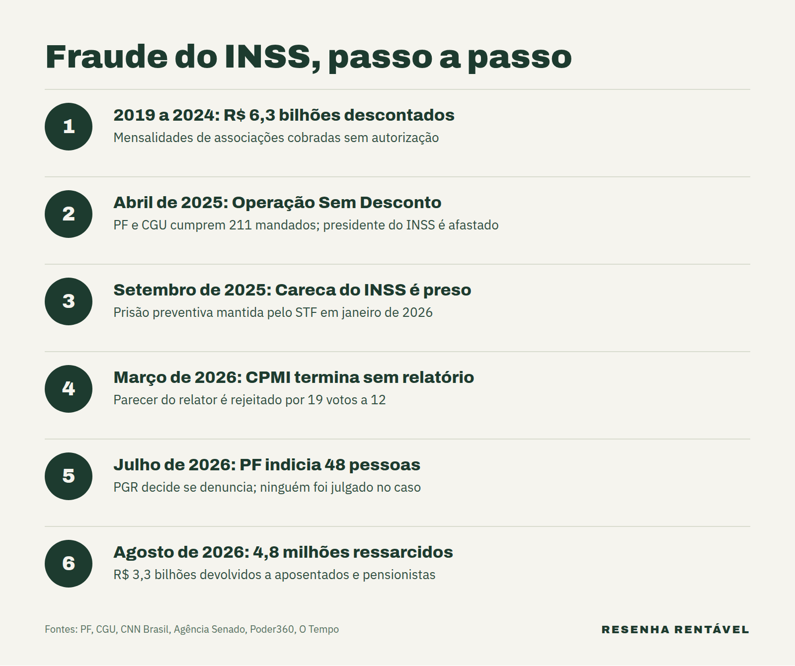

A fraude do INSS foi um esquema de descontos que aposentados e pensionistas nunca autorizaram: associações cobravam mensalidades direto no benefício, com filiações falsas. Segundo a Polícia Federal e a Controladoria-Geral da União (CGU), cerca de R$ 6,3 bilhões saíram assim da folha entre 2019 e 2024. O personagem mais conhecido do caso é o empresário Antônio Carlos Camilo Antunes, o "Careca do INSS", preso desde setembro de 2025 e indiciado pela PF, mas ainda sem julgamento.

O caso continua aberto em 2026. Em julho, a PF indiciou 48 pessoas e fez nova fase da operação. Além disso, em 25 de setembro, o presidente do Supremo Tribunal Federal, Edson Fachin, deu cinco dias úteis para a Procuradoria-Geral da República (PGR) se manifestar sobre pedidos pendentes nas investigações do INSS e do Banco Master, segundo [O Tempo](https://www.otempo.com.br/politica/judiciario/2026/9/25/fachin-cobra-posicoes-da-pgr-sobre-pedidos-ligados-as-investigacoes-dos-casos-master-e-inss). Por isso, entender o esquema ajuda a acompanhar o que vem pela frente.

## Como a fraude do INSS começou a ser descoberta?

O caso veio a público em 23 de abril de 2025, com a Operação Sem Desconto. Naquele dia, cerca de 700 policiais federais e 80 servidores da CGU cumpriram 211 mandados de busca e 6 de prisão temporária no Distrito Federal e em 13 estados. A Justiça também bloqueou mais de R$ 1 bilhão em bens, segundo a [CNN Brasil](https://www.cnnbrasil.com.br/politica/presidente-do-inss-e-afastado-apos-operacao-sobre-fraude-de-r-63-bilhoes/).

No mesmo dia, o então presidente do INSS, Alessandro Stefanutto, foi afastado por decisão judicial. Em seguida, em 2 de maio, o ministro da Previdência, Carlos Lupi, pediu demissão e disse que seu nome "nunca foi citado" nas investigações, de acordo com a [Agência Brasil](https://agenciabrasil.ebc.com.br/politica/noticia/2025-05/apos-fraude-no-inss-lupi-pede-demissao-do-ministerio-da-previdencia). O governo, então, suspendeu todos os acordos que permitiam esse tipo de desconto.

## Como o esquema de descontos funcionava?

A lei permite que associações e sindicatos cobrem mensalidade direto no benefício, desde que o aposentado autorize antes. Para isso, as entidades assinavam com o INSS os chamados acordos de cooperação técnica. O problema, segundo os investigadores, é que a autorização muitas vezes não existia.

Na prática, as entidades simulavam o consentimento. O ministro da CGU citou "falsificação de assinaturas" entre os artifícios usados. Além disso, 72% das entidades não tinham entregado ao INSS a documentação exigida, e muitas prometiam benefícios, como academia e plano de saúde, sem ter estrutura para oferecer, segundo a [CNN Brasil](https://www.cnnbrasil.com.br/politica/entenda-como-funcionava-a-fraude-de-r-6-bilhoes-em-beneficios-do-inss/). Numa auditoria da CGU, 97,6% dos 1.273 aposentados entrevistados disseram que nunca autorizaram os descontos.

O volume cresceu rápido. Os descontos associativos passaram de R$ 413 milhões em 2016 para R$ 2,8 bilhões em 2024, segundo a [Agência Brasil](https://agenciabrasil.ebc.com.br/geral/noticia/2025-04/desconto-ilegal-tera-que-ser-restituido-aposentados-dizem-ministros). Entre janeiro de 2023 e maio de 2024, o INSS recebeu 1 milhão de reclamações.

## Quem é o Careca do INSS?

Antônio Carlos Camilo Antunes é apontado pela PF como lobista e operador do esquema. Segundo os investigadores, ele controlaria 22 empresas usadas como ponte entre as entidades e agentes públicos, e as empresas ligadas a ele receberam R$ 53,6 milhões. Ele foi preso em 12 de setembro de 2025, numa nova fase da operação, segundo a [CNN Brasil](https://www.cnnbrasil.com.br/politica/quem-e-o-careca-do-inss-preso-em-operacao-da-pf-nesta-sexta-12/).

Ele nega participação. Na CPMI do INSS, em setembro de 2025, afirmou: "Nunca fui, não sou e nunca serei esse 'Careca do INSS' que estão falando", segundo a [Agência Senado](https://www12.senado.leg.br/noticias/materias/2025/09/25/2018careca-do-inss2019-nao-responde-perguntas-de-relator-mas-nega-participar-de-fraude). Já em janeiro de 2026, o advogado dele disse que as atividades do cliente eram comerciais e lícitas.

## Em que pé está a investigação da fraude do INSS?

Em janeiro de 2026, o ministro André Mendonça, do STF, manteve a prisão preventiva do empresário, segundo a [Agência Brasil](https://agenciabrasil.ebc.com.br/justica/noticia/2026-01/stf-andre-mendonca-mantem-prisao-do-careca-do-inss). Depois, em 14 de julho, a PF indiciou 48 pessoas, entre elas o Careca do INSS, Stefanutto, um ex-procurador-geral do INSS, o ex-ministro da Previdência José Carlos Oliveira e um deputado federal, de acordo com o [Poder360](https://www.poder360.com.br/poder-justica/pf-indicia-careca-do-inss-e-mais-47-por-descontos-em-aposentadorias/). A defesa do empresário disse que não comentaria o indiciamento.

Indiciamento, porém, não é condenação. Agora cabe à PGR decidir se apresenta denúncia ou pede o arquivamento. Até setembro de 2026, nenhum dos indiciados havia sido julgado no caso. Enquanto isso, em 21 de julho, a PF apreendeu três carros de luxo ligados ao empresário para "descapitalizar" o investigado, segundo o [Correio Braziliense](https://www.correiobraziliense.com.br/politica/2026/07/7465404-pf-apreende-carros-de-luxo-do-careca-do-inss-em-nova-fase-da-operacao-sem-desconto.html).

## O que a CPMI do INSS concluiu?

A comissão parlamentar mista de inquérito foi instalada em 20 de agosto de 2025 e fez 38 reuniões em sete meses. No entanto, terminou em 28 de março de 2026 sem relatório final. O parecer do relator, que pedia o indiciamento de 216 pessoas, foi rejeitado por 19 votos a 12, segundo a [Agência Senado](https://www12.senado.leg.br/noticias/materias/2026/03/28/cpmi-do-inss-termina-sem-relatorio-final). Um texto alternativo, que pedia 130 indiciamentos, não chegou a ser votado.

## Como foi o ressarcimento dos aposentados?

O governo passou a devolver os valores antes mesmo do fim das investigações. Segundo o ministro da Previdência, Wolney Queiroz, 4,8 milhões de aposentados e pensionistas já tinham sido ressarcidos até 14 de agosto de 2026, num total de R$ 3,3 bilhões, de acordo com [O Tempo](https://www.otempo.com.br/cidades/2026/8/14/em-minas-500-mil-aposentados-foram-ressarcidos-por-descontos-indevidos-do-inss-diz-ministro). Ao mesmo tempo, a União tenta recuperar o dinheiro com cerca de R$ 6 bilhões bloqueados das entidades.

O caminho foi a contestação. Primeiro, o aposentado contestava o desconto pelo aplicativo ou site Meu INSS, pela Central 135 ou numa agência dos Correios. Depois, a entidade tinha 15 dias úteis para provar a autorização. Sem prova, o acordo era liberado e o dinheiro caía na conta do benefício. O prazo de contestação, prorrogado várias vezes, terminou em 20 de junho de 2026, segundo a [Agência Brasil](https://agenciabrasil.ebc.com.br/geral/noticia/2026-03/vitimas-de-descontos-indevidos-do-inss-tem-mais-90-dias-para-contestar). Quem contestou dentro do prazo e ainda não recebeu pode acompanhar o pedido pelo Meu INSS.

Vale um alerta: desconfie de quem cobra taxa ou pede senha para "liberar" o ressarcimento. Golpistas costumam usar casos famosos para enganar vítimas, como mostra o [golpe do falso advogado](https://resenharentavel.com/golpe-do-falso-advogado/).

A fraude do INSS mostrou como uma autorização que ninguém conferia virou um desvio bilionário. O dinheiro começou a voltar, mas a parte penal ainda depende da PGR e do Supremo. Para entender outro caso financeiro que também passou pelo STF em 2026, veja o [escândalo do Banco Master](https://resenharentavel.com/banco-master-escandalo/) e o que a [CPI das Bets](https://resenharentavel.com/cpi-das-bets-quem-lucrou/) descobriu sobre quem lucrou com as apostas.

*Foto de capa: Geraldo Magela/Agência Senado (CC BY-SA 4.0)*
