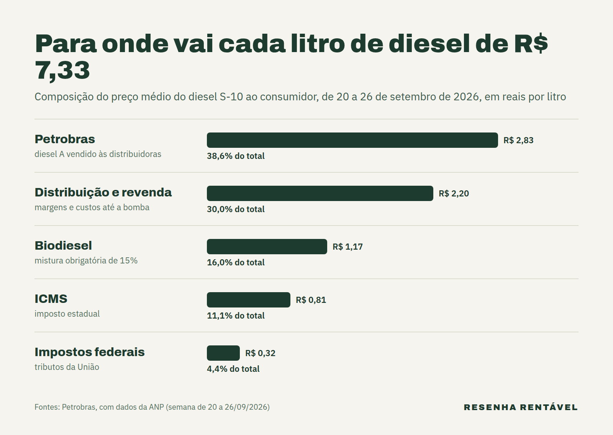

O preço do diesel S-10 chegou a R$ 7,33 por litro na média do país na semana de 20 a 26 de setembro, segundo a ANP. Foi uma alta de 6,5% só em setembro e o maior valor desde abril, de acordo com o [InfoMoney](https://www.infomoney.com.br/economia/preco-do-diesel-s-10-sobe-65-em-setembro-maior-valor-desde-abril-aponta-anp/). Por trás disso estão o petróleo acima de US$ 100, a falta de diesel no mundo e a dependência do Brasil de importações.

O assunto importa agora por dois motivos. Primeiro, outubro é o mês em que o país mais consome diesel, por causa da safra. Além disso, a alta já chegou ao frete: nesta quarta-feira (30), passou a valer a nova tabela de pisos mínimos da ANTT, calculada com o diesel a R$ 7,33. Na prática, transportar carga ficou mais caro, e esse custo costuma aparecer no preço do que chega de caminhão às lojas e aos mercados.

## Quanto está o preço do diesel hoje?

Segundo a ANP, o S-10 custava em média R$ 7,13 na semana anterior e R$ 6,88 no fim de agosto. Ou seja, a alta semanal foi de 2,8%. O recorde recente é de abril, quando o litro chegou a R$ 7,38, de acordo com o InfoMoney.

Numa janela maior, o salto é ainda mais visível. No fim de fevereiro, o litro custava R$ 6,09. Desde então, a alta foi de 20,4%, segundo o [Metrópoles](https://www.metropoles.com/brasil/governo-afirma-que-abastecimento-de-diesel-s-10-esta-garantido-em-outubro). Enquanto isso, a gasolina comum ficou praticamente parada, em R$ 6,55 na mesma semana.

## Por que o diesel ficou mais caro em setembro?

A explicação começa lá fora. Em setembro, o barril do Brent passou de US$ 100 com a tensão no Oriente Médio e os ataques ligados ao Irã, segundo o InfoMoney. A crise no Estreito de Ormuz é explicada em detalhes na matéria sobre a [guerra do Irã](https://resenharentavel.com/guerra-do-ira/).

Ao mesmo tempo, o diesel ficou escasso no mundo. Os ataques da Ucrânia a refinarias russas reduziram a oferta, e a Rússia proibiu a maior parte das exportações em julho de 2026, segundo a [eixos](https://eixos.com.br/combustiveis-e-bioenergia/brasil-entra-no-mes-de-pico-do-diesel-com-80-da-importacao-sob-ameaca-de-trump/). Isso pesa porque o Brasil importa cerca de 30% do diesel que consome. Em 2025, a Rússia vendia ao país 47% do diesel importado. Em agosto de 2026, os embarques russos tinham caído para 56 mil toneladas, contra 909 mil em abril.

## Quem fica com cada parte do preço do diesel?

A Petrobras fica com menos de 40% do valor pago na bomba. Na semana de 20 a 26 de setembro, a parcela da estatal era de R$ 2,83 por litro, segundo a [página de preços da Petrobras](https://precos.petrobras.com.br/precos-diesel), feita com dados da ANP. Distribuição e revenda somavam R$ 2,20. Depois vinham o biodiesel, com R$ 1,17 (a mistura obrigatória é de 15%), o ICMS estadual, com R$ 0,81, e os impostos federais, com R$ 0,32.

## O que o subsídio do governo faz com o preço do diesel?

Em 17 de setembro, a Petrobras subiu em R$ 1 o litro do diesel A vendido às distribuidoras. No entanto, o aumento foi zerado por uma nova subvenção federal do mesmo valor, prevista na Portaria MF nº 2.813, e o preço cobrado das distribuidoras não mudou, segundo o [SBT News](https://sbtnews.sbt.com.br/noticia/brasil/petrobras-aumenta-diesel-em-r-1-mas-valor-permanece-igual). Esse desconto se soma a outro, de R$ 1,12 por litro, criado em maio.

Em 28 de setembro, o governo federal manteve o desconto total de R$ 2,12 por litro, segundo o [SBT News](https://sbtnews.sbt.com.br/noticia/economia/governo-mantem-subsidio-ao-diesel-e-sobe-multa-contra-abusos). Na mesma data, anunciou que a multa máxima por preço abusivo de combustível subiu de R$ 14 milhões para R$ 500 milhões, por medida provisória, de acordo com [O Tempo](https://www.otempo.com.br/economia/2026/9/28/governo-eleva-para-r-500-milhoes-multa-maxima-por-preco-abusivo-do-combustivel). Segundo o jornal, as medidas para conter os combustíveis devem custar R$ 27 bilhões em 2026. O ministro da Justiça, Wellington Lima, afirmou que a punição mira abusos, e não a liberdade de preços.

> "A severidade dessa multa somente terá incidência em casos caracterizados como abuso." Wellington Lima, ministro da Justiça, em 28 de setembro de 2026

## O que Trump tem a ver com o diesel no Brasil?

Com a saída da Rússia, os Estados Unidos viraram o grande fornecedor. Segundo a eixos, com dados da Abicom, 80% do diesel importado em setembro veio dos EUA, e a mesma fatia das compras de outubro já estava contratada lá. Em 22 de setembro, porém, Donald Trump disse que os EUA não iam mais mandar diesel para fora, porque produzem muito, e que o governo analisava restringir as exportações.

No dia seguinte, o secretário de Energia dos EUA, Chris Wright, afirmou que proibir as exportações não funcionaria e deixaria gasolina e querosene de aviação mais caros, segundo a eixos. Até 25 de setembro, a proibição era só uma possibilidade em discussão, de 90 dias, revelada pelo site Politico, de acordo com a [IstoÉ Dinheiro](https://istoedinheiro.com.br/eua-proibem-exportacao-diesel-brasil-impactos). Do lado brasileiro, o secretário de Petróleo e Gás do Ministério de Minas e Energia, Renato Dutra, disse nesta quarta-feira que as importações de outubro "já estão confirmadas", e a ANP descartou risco de faltar diesel, segundo o Metrópoles.

## Como o preço do diesel chega ao frete e à comida?

O caminho mais direto é a tabela de frete. A ANTT publicou em 29 de setembro, em edição extra do Diário Oficial, a Portaria SUROC nº 22, que atualiza os pisos mínimos do frete rodoviário com base no diesel a R$ 7,33, segundo a [Transporte Moderno](https://transportemoderno.com.br/2026/09/30/piso-minimo-do-frete-sobe-com-diesel-a-r-733-e-amplia-pressao-sobre-custos-do-transporte/). A atualização segue a Lei 13.703, de 2018, e vale desde hoje.

Com isso, quem contrata transporte paga mais para levar grãos, bebidas, material de construção e alimentos. Depois, parte dessa conta tende a ser repassada ao preço final. Assim, o diesel mais caro acaba chegando também ao carrinho do supermercado. Além disso, o diesel mais caro também pesa no bolso de quem viaja de ônibus e de quem trabalha com caminhão ou van.

## Resumo

- O diesel S-10 chegou a R$ 7,33 por litro (ANP, 20 a 26 de setembro), alta de 6,5% no mês.
- As causas são o petróleo acima de US$ 100, a saída da Rússia do mercado e a dependência de importações.
- A Petrobras fica com R$ 2,83 por litro; o resto é distribuição, revenda, biodiesel e impostos.
- O governo mantém subsídio de R$ 2,12 por litro e subiu a multa por abuso para até R$ 500 milhões.
- A tabela de frete mínimo da ANTT foi reajustada e vale desde 30 de setembro.

O preço do diesel resume, num número só, uma cadeia que vai do Oriente Médio às refinarias russas e à Casa Branca. Por enquanto, o subsídio segura parte da alta, mas o frete já subiu. Quem acompanha o câmbio também sente o efeito, como mostra a matéria sobre o [dólar antes da eleição](https://resenharentavel.com/dolar-hoje-eleicao/), porque o diesel importado é comprado em dólar.

*Foto de capa: Senado Federal (CC BY 2.0)*
