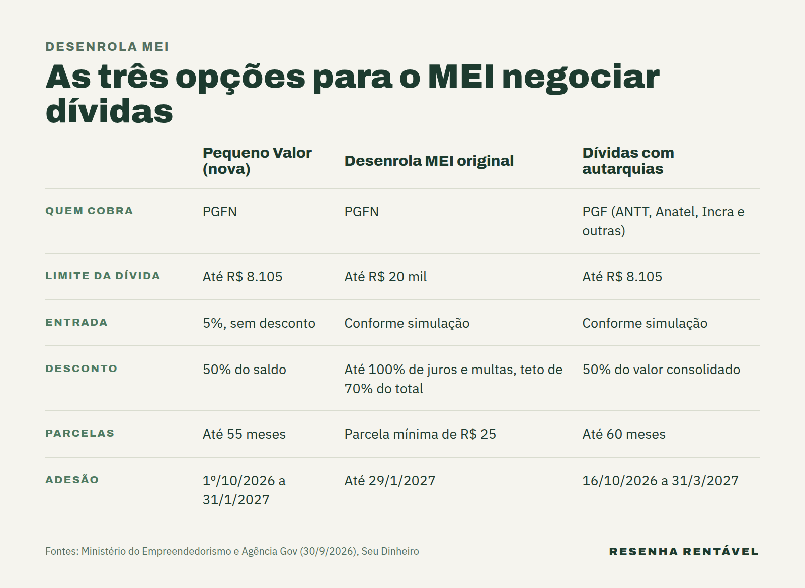

O Desenrola MEI ganhou nesta quinta-feira (1º) uma nova faixa, o Desenrola MEI Pequeno Valor, para microempreendedores com dívidas de até R$ 8.105 com a União. Quem aderir paga 5% de entrada, recebe 50% de desconto sobre o restante e divide o saldo em até 55 meses. A adesão vai até 31 de janeiro de 2027, pelo portal Regularize, da Procuradoria-Geral da Fazenda Nacional (PGFN).

Além da faixa nova, o governo prorrogou até 29 de janeiro de 2027 o Desenrola MEI original, que vencia em 30 de setembro. O anúncio saiu na quarta-feira (30), segundo o [Ministério do Empreendedorismo](https://www.gov.br/memp/pt-br/assuntos/noticias/governo-lanca-desenrola-mei-pequeno-valor-e-amplia-opcoes-para-negociar-dividas). O tema pesa porque o Brasil tem 17,56 milhões de MEIs ativos, e mais de 3 milhões deles estão endividados, com dívida média de R$ 3 mil, de acordo com o governo.

## O que é o Desenrola MEI?

O Desenrola MEI é um programa de renegociação de dívidas do microempreendedor individual com a União. Ele vale para débitos inscritos na dívida ativa, ou seja, impostos e cobranças que a pessoa deixou de pagar e que já foram passados para a cobrança da PGFN. Na prática, é o caso, por exemplo, de guias mensais do MEI que ficaram sem pagamento e foram parar na dívida ativa.

O programa nasceu em julho de 2026, com adesão inicial de 6 de julho a 30 de setembro, segundo o [Seu Dinheiro](https://www.seudinheiro.com/2026/seu-negocio/governo-lanca-desenrola-mei-com-parcelamento-das-dividas-em-ate-145-meses-veja-como-aderir-cbcb/). Ele é diferente do [Desenrola 3.0](https://resenharentavel.com/desenrola-3-0/), que trata das dívidas de pessoas físicas com bancos e lojas. Aqui, o credor é o governo federal.

## Como funciona o Desenrola MEI Pequeno Valor?

A faixa nova é a mais simples. Ela vale para dívidas de até R$ 8.105, o equivalente a cinco salários mínimos. Primeiro, o MEI paga uma entrada de 5% do valor, sem desconto. Depois, o saldo que sobra cai pela metade e pode ser dividido em até 55 parcelas mensais.

Um exemplo ajuda a entender. Numa dívida de R$ 3 mil, que é a média dos MEIs endividados, a entrada seria de R$ 150. Em seguida, os R$ 2.850 restantes cairiam para R$ 1.425 com o desconto. Assim, o total pago ficaria em R$ 1.575, pouco mais da metade da dívida original, numa conta feita a partir das regras divulgadas pelo governo.

> "Para quem é MEI, uma dívida pode pesar no orçamento do seu negócio. Com prazos e condições diferentes, o empreendedor pode avaliar qual negociação se ajusta à sua situação e planejar o pagamento." Paulo Henrique Pereira, ministro do Empreendedorismo, da Microempresa e da Empresa de Pequeno Porte, em 30 de setembro de 2026

## E o Desenrola MEI original, o que muda?

O programa original continua, agora com prazo até 29 de janeiro de 2027. Ele aceita dívidas de até R$ 20 mil e dá desconto de até 100% sobre juros, multas e encargos. Porém, o abatimento tem um teto: no máximo 70% do valor total da dívida.

Nessa modalidade, a parcela mínima é de R$ 25, segundo o Seu Dinheiro e o portal Sul de Minas Online. Como aceita valores maiores, ela é o caminho para quem passa do limite da faixa Pequeno Valor. Enquanto isso, quem deve menos pode comparar as duas opções no simulador antes de escolher.

## Tem negociação para dívidas com agências do governo?

Sim. A partir de 16 de outubro, o MEI também poderá negociar dívidas com autarquias e fundações federais, como ANTT, DNIT, Incra, Anatel, ANP, FNDE e ICMBio. Nesse caso, quem cobra é a Procuradoria-Geral Federal (PGF), um órgão diferente da PGFN.

As condições se parecem com as da faixa nova. Segundo a [Fenacon](https://fenacon.org.br/noticias/microempreendedores-individuais-podem-renegociar-dividas-com-desconto/), que reproduziu o comunicado da Agência Gov, o limite também é de R$ 8.105, o desconto é de 50% sobre o valor consolidado e o parcelamento vai até 60 meses. A adesão a essa transação vai de 16 de outubro de 2026 a 31 de março de 2027.

## Como aderir ao Desenrola MEI?

Todo o processo é online. Primeiro, o empreendedor entra no portal Regularize (regularize.pgfn.gov.br) com a conta gov.br. Depois, consulta as dívidas pelo CNPJ e simula as opções de negociação disponíveis. Por fim, aceita a proposta e emite o boleto da primeira parcela.

Depois do primeiro pagamento, a cobrança fica suspensa e o MEI pode tirar uma certidão positiva com efeitos de negativa, segundo o Seu Dinheiro. Na prática, esse documento mostra que a dívida está em negociação e ajuda quem precisa de crédito ou quer fechar contrato. O alívio chega num momento delicado, em que o país vive ao mesmo tempo [emprego e inadimplência em nível recorde](https://resenharentavel.com/emprego-e-inadimplencia-recorde/).

## Quantos MEIs já negociaram as dívidas?

Até 24 de setembro, o Desenrola MEI tinha 411 mil acordos registrados, segundo o governo. Juntas, essas dívidas somavam R$ 1,26 bilhão antes dos descontos e caíram para R$ 757,25 milhões depois deles. Além disso, a União já recuperou R$ 106,63 milhões com os pagamentos.

Os números mostram que a maior parte dos endividados ainda não negociou. Afinal, são mais de 3 milhões de MEIs com dívidas e pouco mais de 400 mil acordos. A faixa nova chega na mesma semana de outra mudança para pequenos negócios, o adiamento do [prazo do Simples Nacional](https://resenharentavel.com/simples-nacional-2027-prazo/) para 15 de outubro.

Para o microempreendedor, a conta é simples: quem tem dívida de até R$ 8.105 pode pagar pouco mais da metade do valor em até 55 meses, e quem deve até R$ 20 mil tem a modalidade original até o fim de janeiro. Em todos os casos, vale simular no Regularize antes de fechar o acordo.

*Foto de capa: Mateus S. Figueiredo/Wikimedia Commons (CC BY-SA 4.0)*
