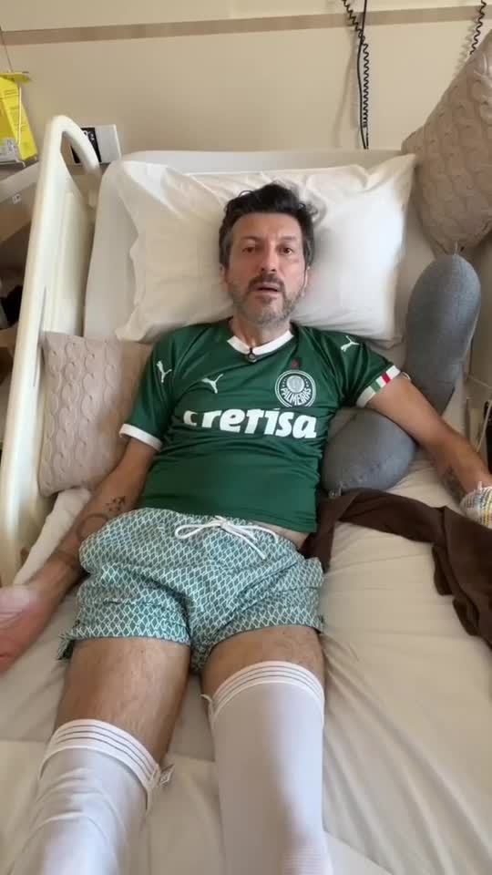
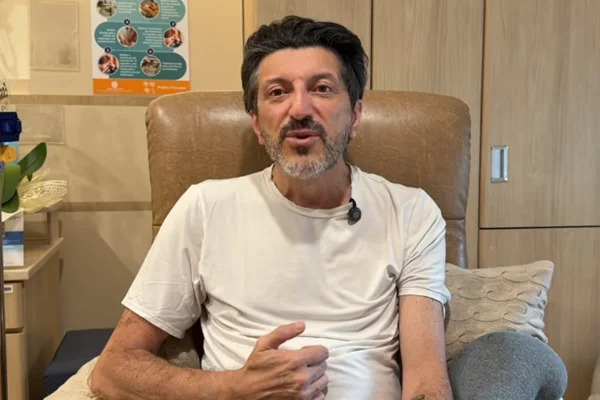

A doença de Creutzfeldt-Jakob foi a causa da morte de Lito Sousa, especialista em aviação e dono do canal Aviões e Músicas, nesta quinta-feira (1º), aos 59 anos, segundo o [Metrópoles](https://www.metropoles.com/celebridades/morre-lito-sousa-especialista-em-aviacao-e-dono-do-canal-avioes-e-musicas). O diagnóstico tinha sido anunciado pela família em 21 de agosto, de acordo com [O Tempo](https://www.otempo.com.br/brasil/2026/8/21/quem-e-lito-sousa-referencia-em-aviacao-e-criador-do-canal-avioes-e-musicas). Ou seja, foram pouco mais de 40 dias entre o anúncio e a morte.

O nome é difícil, e a doença é rara. Por isso, muita gente ouviu falar dela pela primeira vez por causa do Lito. Abaixo, explicamos o que é a doença, por que ela avança tão rápido, como é o diagnóstico, quantos casos o Brasil registra e o que foi o tratamento experimental que ele recebeu.

## O que é a doença de Creutzfeldt-Jakob?

A doença de Creutzfeldt-Jakob, conhecida pela sigla DCJ, ataca o cérebro. Ela é causada por príons, que são proteínas com defeito no formato, segundo a [Gazeta do Povo](https://www.gazetadopovo.com.br/saude/remedio-experimental-para-lito-sousa-chega-ao-brasil/).

Todo mundo tem no corpo a versão normal dessa proteína. O problema começa quando uma delas se dobra do jeito errado. A proteína defeituosa passa a "contaminar" as vizinhas, que também mudam de formato. Assim, elas se acumulam e destroem os neurônios aos poucos, até deixar o cérebro com aspecto de esponja.

Além disso, os príons são muito resistentes. Eles não são destruídos pelos métodos comuns de desinfecção, de acordo com a [CNN Brasil](https://www.cnnbrasil.com.br/saude/entenda-como-funciona-medicamento-experimental-utilizado-em-lito-sousa/). É por isso que hospitais seguem regras especiais para limpar instrumentos usados em pacientes com a doença.

## Quais são os tipos da doença?

A DCJ tem formas diferentes, segundo a [CNN Brasil](https://www.cnnbrasil.com.br/saude/brasil-teve-mais-de-mil-suspeitas-da-doenca-creutzfeldt-jakob-em-16-anos/):

- **Esporádica:** é a mais comum, com cerca de 85% dos casos no mundo. Ela aparece sem causa conhecida e sem histórico na família.
- **Hereditária:** responde por 5% a 15% dos casos e é causada por mutações genéticas passadas de pais para filhos.
- **Iatrogênica:** é rara, com menos de 1% dos casos. Acontece por contaminação acidental em procedimentos médicos, como cirurgias com instrumentos contaminados.
- **Variante:** ficou famosa como a forma humana da "doença da vaca louca", ligada ao consumo de carne bovina contaminada. É muito rara.

"A DCJ esporádica, que é a forma mais comum da doença, se manifesta espontaneamente. Não há causa definida", explicou o neurologista Fábio Porto, diretor científico da Associação Brasileira de Alzheimer, ao [Termômetro da Política](https://www.termometrodapolitica.com.br/geral/noticia/2026/08/21/brasil-registrou-547-casos-confirmados-de-doenca-de-creutzfeldt-jakob-em-16-anos/).

A família de Lito não informou publicamente qual era o tipo da doença dele.

## A doença é contagiosa?

Não no dia a dia. A DCJ não passa por contato social nem pelo ar, segundo a CNN Brasil. Ou seja, abraçar, conversar ou dividir a casa com um paciente não transmite a doença.

## Quais são os sintomas?

Os sinais costumam aparecer de repente e piorar rápido. Entre os principais, segundo a CNN Brasil, estão:

- perda de memória e demência;
- perda de coordenação dos movimentos e tremores;
- espasmos musculares involuntários e paralisia;
- dificuldade para falar e problemas de visão.

No caso de Lito, ele mesmo contou parte do que sentia. Em vídeo publicado em 4 de setembro, disse: "Continuo com inflamação no cérebro, mas felizmente a minha cognição não foi afetada", segundo [O Tempo](https://www.otempo.com.br/entretenimento/2026/9/4/lito-sousa-aparece-em-novo-video-e-atualiza-estado-de-saude-minha-cognicao-nao-foi-afetada). Na época, ele tinha os movimentos limitados e dificuldade para falar, mas dizia que seguia lembrando de tudo do passado.

## Como é feito o diagnóstico?

Não existe um exame simples que confirme a doença sozinho. Os médicos juntam os sintomas com exames como a ressonância magnética do crânio, a tomografia e o eletroencefalograma, que mede a atividade elétrica do cérebro, de acordo com o Termômetro da Política.

## A doença tem cura?

Não. Hoje não existe tratamento que cure a DCJ, segundo a CNN Brasil. Os médicos conseguem apenas aliviar os sintomas e dar conforto ao paciente.

Além disso, a doença avança muito rápido. Cerca de 90% das pessoas morrem em até um ano depois do início dos sintomas, de acordo com a CNN Brasil. Segundo o Termômetro da Política, a expectativa de vida depois do diagnóstico vai de seis meses a um ano.

## Quantos casos o Brasil registra?

A notificação da doença é obrigatória no Brasil desde 2005. De 2005 a 2021, o Ministério da Saúde recebeu 1.576 notificações de casos suspeitos, segundo a CNN Brasil. Desses, 547 foram confirmados, de acordo com o Termômetro da Política.

São Paulo lidera as notificações, com 512 casos suspeitos. Em seguida vêm o Paraná, com 189, e Minas Gerais, com 158, segundo a CNN Brasil. A maior parte das notificações envolve pessoas de 55 a 74 anos.

## O tratamento experimental que Lito recebeu

Sem cura disponível, a família de Lito buscou uma saída fora do país. A esposa, Mila Seidl, contou que conseguiu "por meios próprios o contato" de uma farmacêutica, segundo a Gazeta do Povo.

O remédio se chama ALN-6457 e ainda está em fase de testes em laboratório, com células e animais. Ele usa uma tecnologia chamada RNA de interferência, que tenta "desligar" o gene que produz a proteína dos príons, de acordo com a CNN Brasil. Dessa forma, a ideia é reduzir a matéria-prima que a doença usa para avançar.

A Anvisa autorizou a importação em 4 de setembro, como uso compassivo, que é a liberação excepcional para pacientes sem outra alternativa, segundo a Gazeta do Povo. O remédio chegou de Nova York na madrugada de 12 de setembro e foi levado de helicóptero até o Hospital Israelita Albert Einstein, em São Paulo. Lito foi o primeiro ser humano a receber o medicamento, de acordo com a CNN Brasil.

Mesmo assim, os médicos sempre trataram a aposta com cautela. A neurologista Márcia Rodrigues, do CEJAM, explicou à CNN Brasil que as pesquisas indicam que a estratégia "não é capaz de reverter danos já causados no cérebro". O objetivo era tentar frear ou atrasar o avanço da doença.

## Quem foi Lito Sousa

Lito nasceu em Natal, em 1967, e passou mais de 36 anos na aviação, com passagens pela Varig, pela Transbrasil e pela United Airlines. No canal Aviões e Músicas, que chegou a 3,7 milhões de inscritos, ele explicava os aviões em linguagem simples e ajudou milhões de pessoas a perder o medo de voar. Contamos a trajetória dele [nesta matéria](https://resenharentavel.com/morre-lito-sousa-avioes-e-musicas/).

Antes da DCJ, ele já enfrentava outro problema de saúde. Em 2026, foi diagnosticado com câncer de próstata e ficou internado no Einstein, segundo a [Revista Fórum](https://revistaforum.com.br/brasil/lito-sousa-manutencao-avioes-fenomeno-internet/). Na época, disse que queria usar o alcance que tinha para alertar os homens sobre os exames preventivos.

No vídeo de setembro, mesmo doente, ele se despediu dos seguidores assim: "Um grande abraço e até o próximo voo!".

Lito deixa a esposa, Mila Seidl, e o filho, Malone.
