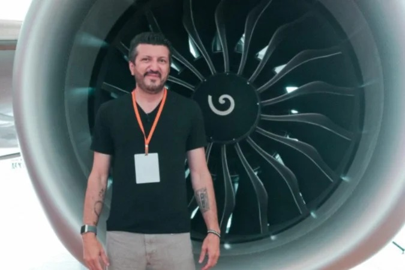

A trajetória de Lito Sousa começa num hangar, não numa cabine de piloto. Joselito Geraldo de Sousa passou mais de 36 anos cuidando de aviões, a maior parte deles na manutenção. Depois, transformou esse conhecimento num dos maiores canais de aviação do Brasil, o Aviões e Músicas. Ele morreu nesta quinta-feira (1º), aos 59 anos, como mostramos [nesta notícia](https://resenharentavel.com/morre-lito-sousa-avioes-e-musicas/).

A história dele é também a de um trabalhador que virou marca. Afinal, do salário de mecânico, Lito chegou a um canal com milhões de inscritos, um livro, uma escola de aviação e trabalhos de consultoria. Veja como foi esse caminho.

## Quem foi Lito Sousa?

Lito nasceu em Natal, no Rio Grande do Norte, em 25 de janeiro de 1967, segundo a [Wikipédia](https://en.wikipedia.org/wiki/Lito_Sousa). Ele começou na aviação aos 19 anos, na Varig, a maior companhia aérea do Brasil na época, de acordo com o [Correio](https://www.correio24horas.com.br/em-alta/morre-lito-sousa-referencia-da-aviacao-brasileira-que-fez-milhoes-perderem-o-medo-de-voar-1026).

Depois, passou pela Transbrasil. Em seguida, foi para a americana United Airlines, onde ficou mais de 25 anos. Nessas empresas, trabalhou como mecânico de aeronaves e supervisor de manutenção, segundo a [Revista Fórum](https://revistaforum.com.br/brasil/lito-sousa-manutencao-avioes-fenomeno-internet/).

## O mecânico que deixava o avião pronto para voar

O trabalho de manutenção é pouco visto por quem viaja. Mesmo assim, é ele que garante que cada peça do avião esteja em ordem antes da decolagem. Foi essa experiência que deu a Lito uma vantagem rara na internet: ele explicava o avião por dentro, como quem já tinha aberto um motor com as próprias mãos.

Com o tempo, ele também passou a atuar como consultor em segurança operacional, gestão de risco e fatores humanos na aviação, segundo [O Tempo](https://www.otempo.com.br/brasil/2026/8/21/quem-e-lito-sousa-referencia-em-aviacao-e-criador-do-canal-avioes-e-musicas). Ou seja, ele estudava não só as máquinas, mas também os erros humanos que podem levar a um acidente.

## Como nasceu o Aviões e Músicas?

O canal foi criado em 2010, de acordo com a Wikipédia. No começo, era um projeto paralelo ao trabalho nas companhias aéreas. Aos poucos, porém, os vídeos ganharam público por um motivo simples: Lito falava de assuntos técnicos em linguagem de conversa.

Ele explicava por que a turbulência assusta, mas raramente é perigosa. Mostrava como funciona a manutenção e respondia às dúvidas de quem tinha medo de voar. Além disso, analisava grandes acidentes aéreos com base nos relatórios oficiais, como os dos Mamonas Assassinas, da Chapecoense e da cantora Marília Mendonça, segundo o [Metrópoles](https://www.metropoles.com/celebridades/morre-lito-sousa-especialista-em-aviacao-e-dono-do-canal-avioes-e-musicas).

Assim, o canal virou uma espécie de serviço público. Sempre que um acidente aparecia no noticiário, muita gente ia ao Aviões e Músicas para entender o que tinha acontecido. O resultado: o canal chegou a 3,7 milhões de inscritos no YouTube, segundo o Correio.

## Do canal para o negócio: livro, escola e cursos

Lito não ficou só nos vídeos. Em 2019, ele lançou o livro "Onde Morrem os Aviões", segundo O Tempo. Depois, criou com a esposa, a empresária Mila Seidl, a Lito Aviation Academy, uma escola de aviação.

A escola oferece cursos para quem tem medo de voar e para quem quer aprender mais sobre aeronaves. Um deles é o "Sem Medo de Voar", lançado em 2022, de acordo com a Wikipédia. Segundo a Revista Fórum, a escola também forma novos mecânicos e profissionais do setor.

Na prática, Lito fez o caminho que muitos criadores de conteúdo tentam seguir: usou a audiência para criar produtos próprios. Dessa forma, a renda deixou de depender apenas dos anúncios do YouTube e passou a vir também de cursos, livro e consultoria.

## Piloto aos 53 anos

Depois de décadas cuidando de aviões em terra, Lito também passou a pilotá-los. Em 2021, aos 53 anos, ele virou piloto, segundo o Correio. Para quem tinha começado como mecânico aos 19, foi a volta completa dentro da aviação.

## A doença e a despedida

Em 2026, Lito tornou pública a própria luta contra a doença. Ele foi diagnosticado com câncer de próstata e ficou internado no Hospital Israelita Albert Einstein, em São Paulo, segundo a Revista Fórum. Na época, disse que queria usar o alcance que tinha para alertar os homens sobre a importância dos exames preventivos.

Em 21 de agosto, a família informou que ele tinha a doença de Creutzfeldt-Jakob, uma doença rara que atinge o cérebro, de acordo com O Tempo. Lito morreu em 1º de outubro. Na despedida, a esposa escreveu "até o próximo voo" e "foi uma honra ter viajado com você", segundo a [Jovem Pan](https://jovempan.com.br/noticias/morre-influenciador-lito-sousa-aos-59-anos/).

Lito deixa a esposa, Mila Seidl, e o filho, Malone. Deixa também milhões de pessoas que embarcaram num avião com menos medo depois de assistir aos vídeos dele.
