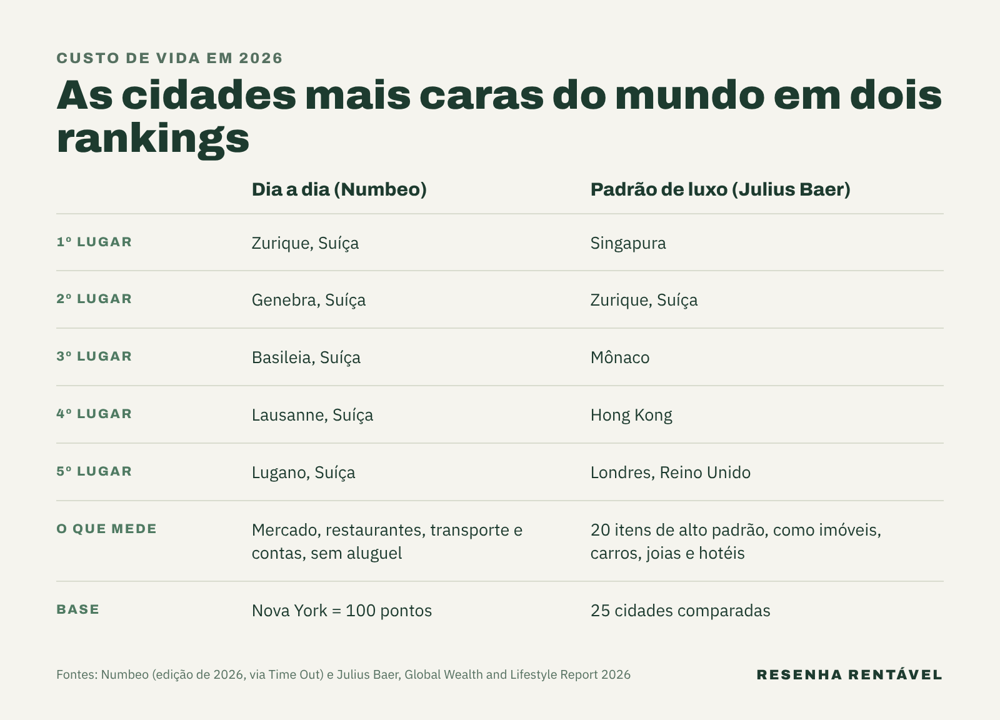

As cidades mais caras do mundo para viver em 2026 são Zurique, quando a conta é o custo do dia a dia, e Singapura, quando a conta é manter um padrão de vida de luxo. A resposta muda conforme o ranking, porque cada um mede uma coisa diferente. Em comum, os dois mostram a Suíça e a Ásia rica no topo.

A pergunta interessa a quem pensa em morar fora, trabalhar em outro país ou só planejar uma viagem sem susto no cartão. Além disso, os rankings ajudam a entender um fenômeno que mexe com qualquer orçamento: o peso da moeda. Quando o franco suíço ou o euro ficam fortes, as cidades desses países sobem na lista, mesmo que os preços locais mudem pouco.

## Quais são as cidades mais caras do mundo no dia a dia?

O ranking mais usado para o custo do cotidiano é o do Numbeo, um site que reúne preços informados por moradores do mundo todo. Na edição de 2026, divulgada em janeiro, as seis primeiras posições ficaram com cidades suíças, segundo a [Time Out](https://www.timeout.com/news/the-cities-with-the-highest-cost-of-living-right-now-revealed-with-the-top-six-all-in-one-european-country-012626). Zurique lidera, seguida de Genebra, Basileia, Lausanne, Lugano e Berna.

Depois vêm Nova York, em 7º lugar, Reykjavik, na Islândia, em 8º, Honolulu, no Havaí, em 9º, e San Francisco, em 10º. O índice usa Nova York como base, com nota 100. Assim, Zurique marcou 118,5 pontos, ou seja, o custo de vida lá é cerca de 18% maior que o da maior cidade americana. Nos restaurantes, a nota de Zurique chega a 121, e no supermercado, a 115,4.

## Por que a Suíça domina o ranking?

A explicação passa pelo salário e pela moeda. O Numbeo também mede o poder de compra local, isto é, quanto o salário médio da cidade consegue comprar. Nesse quesito, Zurique marcou 164,4 pontos, bem acima dos 100 de Nova York, segundo a Time Out. Na prática, tudo é caro, mas quem ganha em franco suíço consegue pagar a conta com mais folga.

Para o turista ou para quem chega com salário em real, porém, a história é outra. O franco é uma das moedas mais fortes do mundo, e isso encarece cada café, passagem de trem ou aluguel. Vale lembrar um detalhe do método: o índice principal do Numbeo soma mercado, restaurantes, transporte e contas da casa, mas não inclui o aluguel, que aparece numa conta separada, como explica o [blue News](https://www.bluewin.ch/en/news/switzerland/living-in-switzerland-more-expensive-than-in-new-york-3068909.html). Por isso, cidades com moradia caríssima, como Nova York e San Francisco, podem subir ainda mais quando o aluguel entra na conta.

## E as cidades mais caras do mundo para quem vive no luxo?

Aqui o ranking de referência é o do banco suíço Julius Baer. O [Global Wealth and Lifestyle Report 2026](https://www.juliusbaer.com/en/media/news-portal/julius-baer-publishes-global-wealth-and-lifestyle-report-2026/), publicado em julho, compara 20 produtos e serviços de alto padrão em 25 cidades, de imóveis e carros a joias, relógios, hotéis e restaurantes. A coleta de preços terminou em fevereiro de 2026.

Singapura ficou em 1º lugar pelo quarto ano seguido. Zurique subiu três posições e ficou em 2º, e Mônaco entrou pela primeira vez no top 3. Em seguida, Hong Kong caiu para o 4º lugar e Londres, para o 5º, segundo o banco. Xangai, Sydney e Bangkok também estão entre as dez mais caras, e Sydney foi a que mais subiu: seis posições, até o 8º lugar. Já Nova York é a mais cara das Américas.

## Por que Singapura é tão cara?

O relatório aponta os preços altos de imóveis residenciais e de carros, somados à força do dólar de Singapura, segundo a [WealthBriefing](https://www.wealthbriefing.com/html/article.php/zurich-ranked-second-in-top-ten-most-expensive-cities-in-2026%2C-after-singapore--julius-baer). O carro é um caso à parte. Para registrar um veículo, o morador precisa comprar em leilão do governo um certificado chamado COE.

Em 9 de setembro de 2026, o certificado para carros pequenos e elétricos bateu o recorde de 133.009 dólares de Singapura, segundo o jornal The Straits Times, reproduzido pelo [The Star](https://www.thestar.com.my/aseanplus/aseanplus-news/2026/09/09/singapore039s-coe-premiums-up-across-the-board-category-a-price-hits-all-time-high-of-s133009). Esse valor é só a licença, sem contar o carro. Mônaco segue a mesma lógica, com imóveis caríssimos e o euro forte, de acordo com a WealthBriefing.

## Onde São Paulo aparece no ranking?

No ranking de luxo do Julius Baer, São Paulo subiu para o 12º lugar em 2026, à frente de Dubai, que caiu para o 14º. Segundo o banco, a alta veio do forte aumento de preços locais e do movimento do câmbio. Em outras palavras, manter um padrão de vida de alto luxo na capital paulista já custa mais do que em Dubai, de acordo com a cesta do relatório.

O mesmo estudo mostra que o luxo ficou mais caro no mundo todo. Em média, o custo da vida de alto padrão subiu 10,2% em dólares. Na Europa, a alta foi de 14,1%, e na Ásia-Pacífico, de 7,4%. As joias subiram 16,4% e os relógios, 15,5%, puxados pelo ouro, cujo preço mais que dobrou desde 2024.

## E os países mais caros para viver?

Quando a comparação é por país, o topo muda de novo. Num levantamento do Visual Capitalist com dados do Numbeo, publicado em março pelo [idealista](https://www.idealista.pt/news/financas/economia/2026/03/26/74353-estes-sao-os-paises-com-o-custo-de-vida-mais-elevado-em-2026), Bermudas lidera, seguida das Ilhas Virgens Americanas, da Suíça, de Jersey e de Singapura. Os Estados Unidos aparecem só em 19º, e Portugal, em 51º.

A lição é que lugares pequenos, ricos e que importam quase tudo tendem a ser os mais caros. Para o brasileiro, a conta ainda passa pelo câmbio, como explicamos ao mostrar [por que o real cai antes da eleição](https://resenharentavel.com/dolar-hoje-eleicao/). A reputação de cada país também pesa, como contamos na matéria sobre [marca país](https://resenharentavel.com/o-que-e-marca-pais/).

No fim, não existe uma única cidade mais cara do mundo. Zurique pesa mais no bolso de quem faz compras no mercado e janta fora, enquanto Singapura pesa mais em quem compra imóvel, carro e relógio. Em todos os rankings, o câmbio tem um papel enorme na conta, e é ele que decide quanto custa, em reais, cada um desses lugares.

*Foto de capa: sdh_zh/Wikimedia Commons (CC BY 2.0)*
