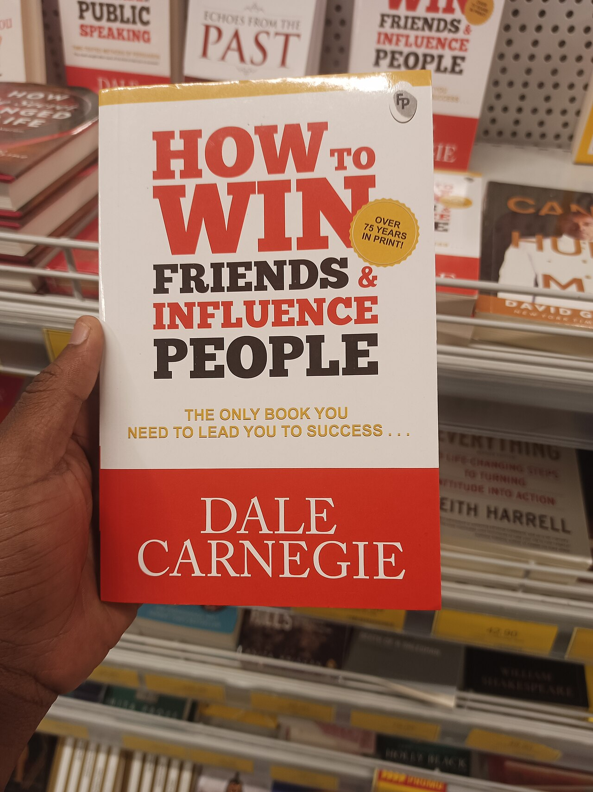
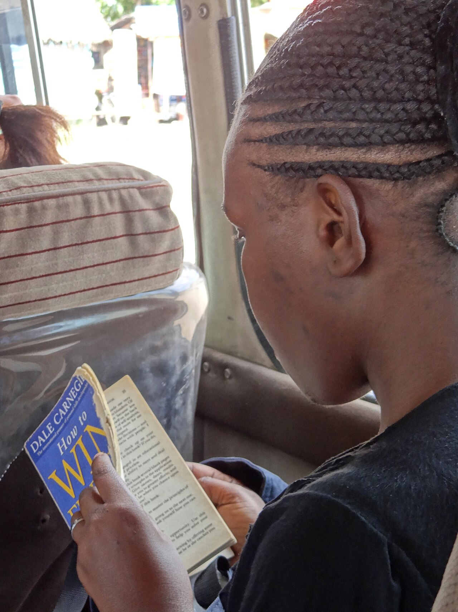
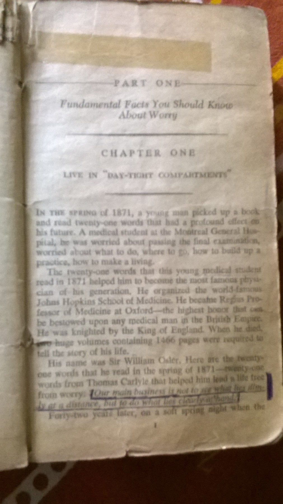

Dale Carnegie nasceu pobre, numa fazenda do Missouri, e passou a juventude vendendo de tudo: cursos por correspondência, bacon, sabão e banha. Décadas depois, escreveu "Como Fazer Amigos e Influenciar Pessoas", que passou de 30 milhões de cópias vendidas no mundo, segundo a [Wikipédia](https://en.wikipedia.org/wiki/How_to_Win_Friends_and_Influence_People). O livro ainda vende mais de 250 mil exemplares por ano.

A virada, porém, não veio de uma grande ideia. Veio de um acordo de porcentagem com uma ACM de Nova York e de anos dando aula para adultos com medo de falar em público. Veja como foi a trajetória do homem que transformou "saber lidar com gente" num negócio.

## Quem foi Dale Carnegie?

Dale Carnegie nasceu em 24 de novembro de 1888, em Maryville, no Missouri, nos Estados Unidos, de acordo com a [Wikipédia](https://en.wikipedia.org/wiki/Dale_Carnegie). Era o segundo filho de um casal de fazendeiros pobres. Na infância, estudou em escolas rurais de uma sala só.

Aos 16 anos, mudou-se com a família para uma fazenda perto de Warrensburg. Lá, terminou o ensino médio em 1906 e descobriu o gosto pelos debates e pelos discursos. Em 1908, formou-se na escola estadual de professores da cidade, hoje Universidade do Centro do Missouri.

Um detalhe curioso: o sobrenome original da família era Carnagey. Ele só mudou a grafia para Carnegie por volta de 1922, segundo a Wikipédia. O motivo, de acordo com a enciclopédia, era prático: ninguém escrevia o nome dele do jeito certo.

## O vendedor de bacon que virou campeão de vendas

O primeiro emprego de Carnegie foi vender cursos por correspondência para fazendeiros. Depois, ele foi trabalhar na Armour & Company, uma gigante americana de carnes, vendendo bacon, sabão e banha.

E ele vendia bem. Carnegie fez da região de South Omaha, no estado de Nebraska, a líder nacional de vendas da empresa, segundo a Wikipédia. Mesmo assim, quando juntou 200 dólares, em 1911, largou as vendas para tentar outra carreira: queria ser ator.

Ele chegou a estudar na Academia Americana de Artes Dramáticas, em Nova York. No entanto, a carreira nos palcos não deslanchou.

## Como uma aula noturna virou um negócio

Por volta de 1912, sem dinheiro e sem papéis no teatro, Carnegie convenceu a ACM (Associação Cristã de Moços) da rua 125, em Nova York, a deixá-lo dar aulas de oratória para adultos. O acordo é a parte mais interessante da história: em vez de salário fixo, ele ficaria com 80% do lucro líquido das aulas, segundo a Wikipédia.

Ou seja, ele só ganharia se os alunos aparecessem. E apareceram. Nas aulas, Carnegie descobriu um truque para tirar o medo dos alunos: pedia que falassem sobre algo que os deixava com raiva. Assim, eles esqueciam a vergonha e falavam com naturalidade.

Em 1914, dois anos depois, ele já ganhava 500 dólares por semana, de acordo com a Wikipédia. Em valores de hoje, são cerca de 16 mil dólares por semana. Em 1916, chegou a lotar o Carnegie Hall, a famosa casa de espetáculos de Nova York, com uma palestra.

## O livro que nasceu de um curso

"Como Fazer Amigos e Influenciar Pessoas" não começou como livro. Em 1934, Leon Shimkin, da editora Simon & Schuster, fez o curso de 14 semanas de Carnegie, segundo a Wikipédia. Gostou tanto que contratou um estenógrafo para anotar as aulas. Depois, Carnegie editou esse material até virar o livro.

O lançamento foi em 1936. A primeira tiragem era de apenas 1.200 cópias, mas a procura obrigou a editora a imprimir muito mais. Em três meses, foram 250 mil exemplares vendidos, e o livro teve 17 edições só no primeiro ano, de acordo com a Wikipédia.

Hoje, o livro aparece em listas das obras mais influentes. A revista Time o colocou em 19º lugar entre os 100 livros de não ficção mais influentes, em 2011. Além disso, a Biblioteca do Congresso dos Estados Unidos o incluiu numa lista dos livros mais influentes do país, segundo a Wikipédia.

Por outro lado, a obra também teve críticos. O escritor Sinclair Lewis, por exemplo, acusou o livro de ensinar a manipular as pessoas.

## O que o livro ensina?

A ideia central é simples: quem aprende a lidar com pessoas ganha mais na carreira e nos negócios. A edição original tinha seis partes, com técnicas para tratar bem as pessoas, convencer os outros, liderar e até escrever cartas de negócios, segundo a Wikipédia.

Em 1948, Carnegie lançou outro sucesso, "Como Evitar Preocupações e Começar a Viver". Dessa vez, o tema era a ansiedade do dia a dia.

## Warren Buffett foi aluno

Entre os alunos mais famosos do curso de Carnegie está Warren Buffett. O investidor fez o curso aos 20 anos e guardou o diploma no escritório, de acordo com a Wikipédia.

## A morte e o legado

Carnegie morreu em 1º de novembro de 1955, em Nova York, aos 66 anos. Até lá, o instituto que levava o nome dele já tinha formado 450 mil alunos, e ele próprio tinha avaliado mais de 150 mil discursos, segundo a Wikipédia.

Depois da morte dele, a esposa, Dorothy Carnegie, assumiu a empresa. Hoje, a Dale Carnegie Training continua dando cursos de comunicação e liderança pelo mundo.

No fim, a maior lição da trajetória dele talvez esteja no começo: o vendedor que aprendeu a convencer clientes no interior dos Estados Unidos transformou exatamente essa habilidade no produto que o deixou famoso.
