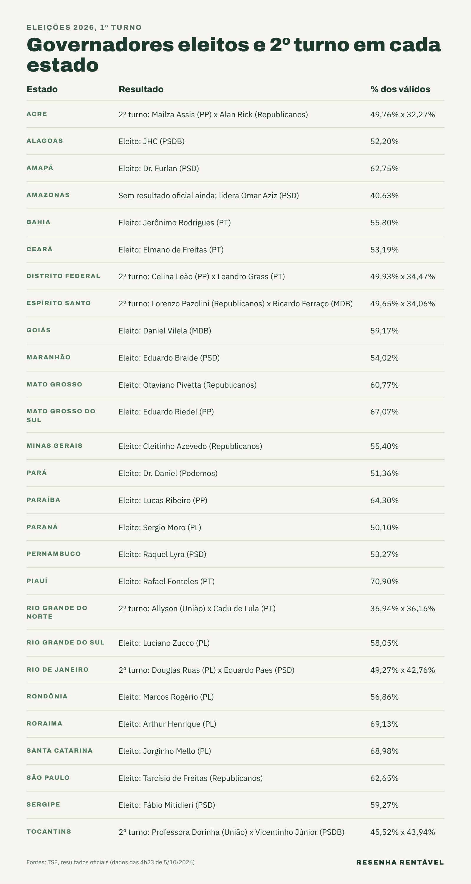

Os governadores eleitos no primeiro turno de 2026 já são conhecidos em 20 dos 26 estados, segundo os resultados oficiais do [TSE](https://resultados.tse.jus.br/). Outras seis unidades da Federação (Acre, Distrito Federal, Espírito Santo, Rio de Janeiro, Rio Grande do Norte e Tocantins) terão segundo turno em 25 de outubro. No Amazonas, a totalização ainda não tinha sido concluída pelo TSE até a madrugada desta segunda-feira (5).

Para vencer no primeiro turno, o candidato a governador precisa de mais da metade dos votos válidos, ou seja, dos votos dados a candidatos, sem contar brancos e nulos. Quando ninguém chega lá, os dois mais votados voltam às urnas. Por isso, em vários estados a disputa terminou no domingo (4), enquanto em outros ela continua por mais três semanas. Todos os números deste texto são do TSE e foram conferidos às 4h23 desta segunda.

## Quem são os governadores eleitos no Norte e no Nordeste?

No Norte, quatro estados fecharam a eleição no domingo. Dr. Furlan (PSD) venceu no Amapá com 62,75% dos votos válidos. No Pará, Dr. Daniel (Podemos) teve 51,36%. Em Rondônia, Marcos Rogério (PL) somou 56,86%, e em Roraima, Arthur Henrique (PL) chegou a 69,13%.

No Nordeste, oito dos nove estados elegeram o governador no primeiro turno, e só o Rio Grande do Norte terá nova votação. Em Alagoas, JHC (PSDB) foi eleito com 52,20%. Na Bahia, Jerônimo Rodrigues (PT) teve 55,80%, e no Ceará, Elmano de Freitas (PT) somou 53,19%. Além disso, Eduardo Braide (PSD) venceu no Maranhão com 54,02%, e Lucas Ribeiro (PP) ganhou na Paraíba com 64,30%.

Em Pernambuco, Raquel Lyra (PSD) foi eleita com 53,27%. No Piauí, Rafael Fonteles (PT) teve a maior porcentagem do país entre os governadores, com 70,90% dos votos válidos. Por fim, em Sergipe, Fábio Mitidieri (PSD) venceu com 59,27%.

## E no Sudeste, no Sul e no Centro-Oeste?

No Sudeste, dois estados já têm governador. Em Minas Gerais, Cleitinho Azevedo (Republicanos) foi eleito com 55,40%, o equivalente a 6.321.590 votos. Em São Paulo, Tarcísio de Freitas (Republicanos) venceu com 62,65%, ou 14.491.874 votos, a maior votação do país para o cargo.

O Sul resolveu tudo no primeiro turno. No Paraná, Sergio Moro (PL) foi eleito com 50,10%, a vitória mais apertada acima da linha dos 50%. Já no Rio Grande do Sul, Luciano Zucco (PL) teve 58,05%, e em Santa Catarina, Jorginho Mello (PL) chegou a 68,98%.

No Centro-Oeste, três estados elegeram o governador. Daniel Vilela (MDB) venceu em Goiás com 59,17%. Em Mato Grosso, Otaviano Pivetta (Republicanos) teve 60,77%, e em Mato Grosso do Sul, Eduardo Riedel (PP) somou 67,07%. O Distrito Federal, por outro lado, terá segundo turno.

## Onde vai ter segundo turno para governador?

Seis disputas continuam, segundo o TSE. No Acre, Mailza Assis (PP), com 49,76%, enfrenta Alan Rick (Republicanos), que teve 32,27%. No Distrito Federal, Celina Leão (PP) terminou com 49,93% e disputa com Leandro Grass (PT), que somou 34,47%. Nos dois casos, a primeira colocada ficou a menos de um ponto da marca de 50% dos votos válidos.

No Espírito Santo, Lorenzo Pazolini (Republicanos), com 49,65%, enfrenta Ricardo Ferraço (MDB), com 34,06%. No Rio de Janeiro, Douglas Ruas (PL) teve 49,27% e Eduardo Paes (PSD), 42,76%. Enquanto isso, o Rio Grande do Norte terá a disputa mais equilibrada: Allyson (União) ficou com 36,94% e Cadu de Lula (PT), com 36,16%, uma diferença de 15.509 votos. Em Tocantins, Professora Dorinha (União), com 45,52%, enfrenta Vicentinho Júnior (PSDB), com 43,94%.

## O que falta no Amazonas?

No Amazonas, o TSE já tinha 100% das urnas apuradas, mas ainda não havia marcado a situação final de nenhum candidato até as 4h23 desta segunda. Nesse momento, Omar Aziz (PSD) estava à frente, com 40,63% dos votos válidos, seguido por Professora Maria do Carmo (PL), com 24,49%, e Roberto Cidade (União), com 21,91%.

Como nenhum candidato passou de 50%, a tendência é de nova votação no estado, e o jornal [O Tempo](https://www.otempo.com.br/eleicoes/2026/governadores/2026/10/4/veja-os-governadores-ja-eleitos-seis-estados-e-o-df-terao-segundo-turno) já lista o Amazonas entre os estados com segundo turno. Mesmo assim, o resultado só é oficial quando o TSE conclui a totalização. Para entender como esse processo funciona, veja [como funciona a apuração](https://resenharentavel.com/como-funciona-a-apuracao/).

## Quando é o segundo turno e quando os governadores eleitos tomam posse?

O segundo turno será no domingo, 25 de outubro, das 8h às 17h pelo horário de Brasília. Nessas seis unidades da Federação, o eleitor vai votar para governador e também para presidente, já que Flávio Bolsonaro (PL) e Lula (PT) disputam a [segunda rodada da eleição presidencial](https://resenharentavel.com/flavio-bolsonaro-e-lula-segundo-turno/). Nos outros estados, a urna mostra só o cargo de presidente.

Os governadores eleitos tomam posse em 6 de janeiro de 2027, e não mais em 1º de janeiro. A mudança veio da Emenda Constitucional 111, aprovada pelo Congresso em 2021, segundo o [Poder360](https://www.poder360.com.br/congresso/lula-tera-mandato-de-4-anos-e-5-dias-e-vai-ate-2027/). O mandato é de quatro anos. Para saber o que faz e quanto recebe um governador, veja [quanto ganha cada político](https://resenharentavel.com/quanto-ganha-cada-politico/).

Com isso, o mapa dos governos estaduais está quase completo: 20 estados já sabem quem vai governar a partir de 2027, e o restante do país decide em três semanas.

*Foto de capa: Edilson Rodrigues/Agência Senado (CC BY 2.0)*
