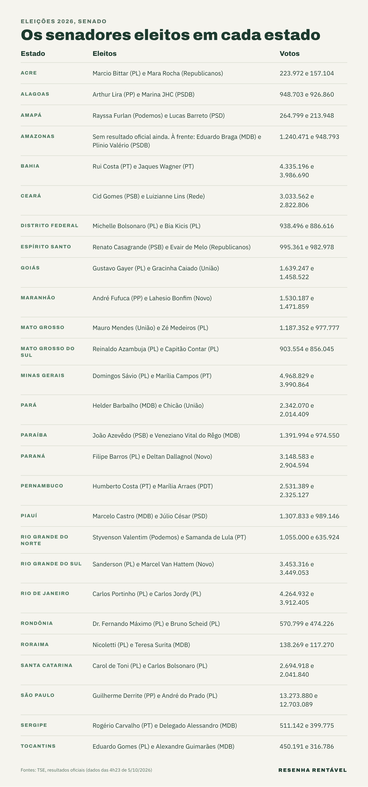

Os senadores eleitos em 2026 ocupam 54 das 81 cadeiras do Senado, dois por estado e dois pelo Distrito Federal, segundo os resultados oficiais do [TSE](https://resultados.tse.jus.br/). Até as 4h23 desta segunda-feira (5), o TSE já tinha confirmado 52 nomes. Só no Amazonas a totalização ainda não estava concluída.

A eleição para o Senado é majoritária: vencem os mais votados em cada estado, sem a conta de votos por partido que vale para deputado. Desta vez, cada eleitor deu dois votos, porque a renovação foi de dois terços da Casa. Os outros 27 senadores, eleitos em 2022, ficam no cargo até janeiro de 2031, de acordo com a [Agência Brasil](https://agenciabrasil.ebc.com.br/politica/noticia/2026-10/veja-quem-sao-os-novos-senadores-e-como-fica-composicao-do-senado). Já o mandato dos novos senadores eleitos é de oito anos, até 2034.

## Quem são os senadores eleitos no Norte?

No Acre, foram eleitos Marcio Bittar (PL), com 223.972 votos, e Mara Rocha (Republicanos), com 157.104. No Amapá, Rayssa Furlan (Podemos) teve 264.799 votos e Lucas Barreto (PSD), 213.948. No Pará, Helder Barbalho (MDB) somou 2.342.070 votos, e Chicão (União), 2.014.409.

Em Rondônia, as duas vagas ficaram com o PL: Dr. Fernando Máximo, com 570.799 votos, e Bruno Scheid, com 474.226. Em Roraima, venceram Nicoletti (PL), com 138.269, e Teresa Surita (MDB), com 117.270. Por fim, em Tocantins, Eduardo Gomes (PL) teve 450.191 votos e Alexandre Guimarães (MDB), 316.786.

## E no Nordeste?

Em Alagoas, Arthur Lira (PP) teve 948.703 votos e Marina JHC (PSDB), 926.860. Na Bahia, o PT ficou com as duas cadeiras: Rui Costa, com 4.335.196 votos, e Jaques Wagner, com 3.986.690. No Ceará, foram eleitos Cid Gomes (PSB), com 3.033.562, e Luizianne Lins (Rede), com 2.822.806.

No Maranhão, venceram André Fufuca (PP), com 1.530.187 votos, e Lahesio Bonfim (Novo), com 1.471.859. Na Paraíba, João Azevêdo (PSB) teve 1.391.994 votos e Veneziano Vital do Rêgo (MDB), 974.550. Em Pernambuco, Humberto Costa (PT) somou 2.531.389, e Marília Arraes (PDT), 2.325.127.

Além disso, no Piauí, foram eleitos Marcelo Castro (MDB), com 1.307.833 votos, e Júlio César (PSD), com 989.146. No Rio Grande do Norte, Styvenson Valentim (Podemos) teve 1.055.000 votos e Samanda de Lula (PT), 635.924. Em Sergipe, venceram Rogério Carvalho (PT), com 511.142, e Delegado Alessandro (MDB), com 399.775.

## Quem ganhou no Sudeste, no Sul e no Centro-Oeste?

Em São Paulo, Guilherme Derrite (PP) teve 13.273.880 votos, a maior votação do país para o Senado, e André do Prado (PL) somou 12.703.089. Em Minas Gerais, foram eleitos Domingos Sávio (PL), com 4.968.829, e Marília Campos (PT), com 3.990.864. No Rio de Janeiro, o PL ficou com as duas vagas: Carlos Portinho, com 4.264.932, e Carlos Jordy, com 3.912.405. No Espírito Santo, venceram Renato Casagrande (PSB), com 995.361, e Evair de Melo (Republicanos), com 982.978.

No Sul, o Paraná elegeu Filipe Barros (PL), com 3.148.583 votos, e Deltan Dallagnol (Novo), com 2.904.594. No Rio Grande do Sul, Sanderson (PL) teve 3.453.316 votos e Marcel Van Hattem (Novo), 3.449.053, uma diferença de apenas 4.263 votos entre os dois eleitos. Em Santa Catarina, o PL levou as duas cadeiras com Carol de Toni (2.694.918) e Carlos Bolsonaro (2.041.840).

No Centro-Oeste, o Distrito Federal elegeu Michelle Bolsonaro (PL), com 938.496 votos, e Bia Kicis (PL), com 886.616. Em Goiás, venceram Gustavo Gayer (PL), com 1.639.247, e Gracinha Caiado (União), com 1.458.522. Em Mato Grosso, Mauro Mendes (União) teve 1.187.352 votos e Zé Medeiros (PL), 977.777. Já em Mato Grosso do Sul, as duas vagas ficaram com o PL: Reinaldo Azambuja (903.554) e Capitão Contar (856.045).

## O que falta no Amazonas?

No Amazonas, todas as urnas já tinham sido apuradas, mas o TSE ainda não havia marcado a situação final dos candidatos até as 4h23. Nesse momento, Eduardo Braga (MDB) liderava com 1.240.471 votos. Em seguida vinham Plinio Valério (PSDB), com 948.793, e Capitão Alberto Neto (PL), com 909.155, separados por menos de 40 mil votos na disputa pela segunda vaga.

## Como fica o Senado depois da eleição?

Entre os 52 senadores eleitos já confirmados pelo TSE, o PL conquistou 19 cadeiras. Em seguida vêm PT e MDB, com 6 cada; PP, PSB, União e Novo, com 3 cada; Republicanos, Podemos e PSD, com 2 cada; e PSDB, Rede e PDT, com 1 cada. Somando os senadores que continuam no mandato, o PL passa a ter 28 das 81 cadeiras, cerca de um terço da Casa, segundo o [Seu Dinheiro](https://www.seudinheiro.com/2026/politica/com-eleicoes-de-2026-pl-passa-a-ter-um-terco-das-cadeiras-no-senado-quem-sao-os-novos-senadores-giov/).

O tamanho das bancadas importa porque o Senado vota leis, aprova indicações para o STF e o Banco Central e julga processos de impeachment. Para entender o papel de cada Casa, veja a [diferença entre deputado e senador](https://resenharentavel.com/diferenca-entre-deputado-e-senador/). Já o salário de um senador está em [quanto ganha cada político](https://resenharentavel.com/quanto-ganha-cada-politico/).

## Quando os senadores eleitos tomam posse?

Os novos senadores tomam posse em 1º de fevereiro de 2027, no início da nova legislatura, e ficam no cargo até 2034, segundo o jornal [O Povo](https://www.opovo.com.br/noticias/politica/eleicoes/2026/07/23/amp/como-e-a-eleicao-para-senador-entenda-as-regras.html). A disputa mais apertada pela segunda vaga, entre os estados já definidos, foi no Rio Grande do Norte: Samanda de Lula (PT) ficou 5.765 votos à frente de Zenaide Maia (PSD). Com o Amazonas pendente, faltam só 2 das 54 vagas para o novo Senado ficar completo.

*Foto de capa: Jonas Pereira/Agência Senado (CC BY 2.0)*
