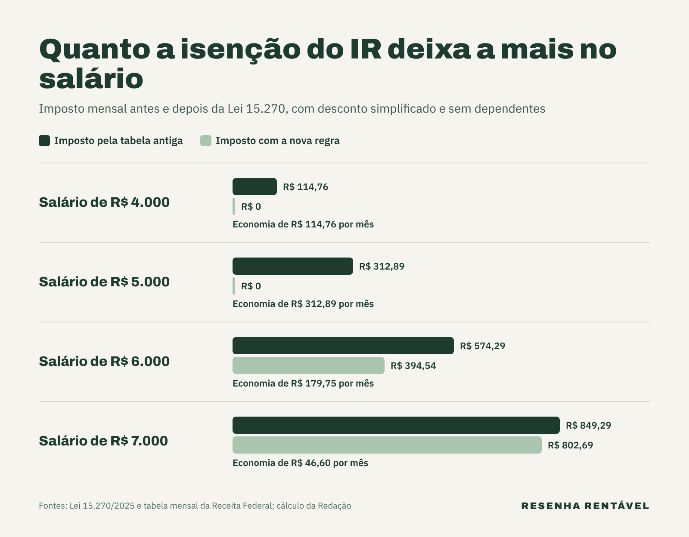

A isenção do imposto de renda vale desde 1º de janeiro de 2026 para quem ganha até R$ 5 mil por mês: esse trabalhador deixou de ter IR descontado no salário. Além disso, quem recebe entre R$ 5.000,01 e R$ 7.350 passou a pagar menos, com um desconto que diminui conforme a renda sobe. Na prática, quem ganha R$ 5 mil ficou com até R$ 312,89 a mais por mês.

A regra veio da [Lei 15.270](https://planalto.gov.br/ccivil_03/_ato2023-2026/2025/lei/L15270.htm), sancionada em 26 de novembro de 2025, depois de passar pela Câmara e pelo Senado, onde foi aprovada por unanimidade em 5 de novembro. O assunto continua entre os mais buscados porque o efeito completo só aparece na declaração de 2027. Por isso, muita gente ainda tem dúvida sobre quem entra na regra, quanto sobra e se ainda precisa declarar.

## Quem tem direito à isenção do imposto de renda?

Tem direito quem recebe até R$ 5 mil por mês em rendimentos tributáveis, como salário, aposentadoria e aluguel. Para essa faixa, a lei criou um redutor de até R$ 312,89 por mês, que é exatamente o imposto que essa renda pagaria pela tabela antiga. Ou seja, o imposto continua sendo calculado, mas o desconto zera a conta.

Segundo a [Agência Brasil](https://agenciabrasil.ebc.com.br/economia/noticia/2025-12/isencao-de-ir-para-quem-ganha-ate-r-5-mil-entra-em-vigor), cerca de 15 milhões de brasileiros ficaram totalmente isentos. Somando quem recebe o desconto parcial, o governo estima que cerca de 25 milhões de pessoas passaram a pagar menos imposto, também de acordo com a [Agência Brasil](https://agenciabrasil.ebc.com.br/economia/noticia/2025-11/saiba-quem-sera-contemplado-e-como-funcionara-isencao-do-ir). A renúncia estimada é de R$ 25,4 bilhões por ano.

## Como funciona o desconto para quem ganha até R$ 7.350?

Acima de R$ 5 mil, o redutor não desaparece de uma vez. Para quem ganha entre R$ 5.000,01 e R$ 7.350, a lei manda calcular o desconto com uma fórmula: R$ 978,62 menos 0,133145 vezes a renda tributável do mês. Assim, quanto maior o salário, menor o abatimento, até chegar a zero em R$ 7.350.

Essa transição existe para evitar um "degrau". Sem ela, quem ganhasse R$ 5.001 pagaria centenas de reais a mais do que quem ganha R$ 5.000. Na lei, a mesma lógica vale para a conta anual: isenção total para até R$ 60 mil por ano e desconto decrescente até R$ 88.200.

## Quanto sobra no salário com a nova regra?

Para fazer as contas, a Redação usou a tabela mensal da Receita Federal, o desconto simplificado de R$ 607,20 e o redutor da Lei 15.270, num trabalhador sem dependentes. Os valores reais podem mudar um pouco, porque a folha de pagamento também considera o INSS e outras deduções.

Primeiro, quem ganha R$ 4 mil pagaria R$ 114,76 de imposto por mês e agora não paga nada. Depois, quem ganha R$ 5 mil pagaria R$ 312,89 e também ficou isento. Já quem ganha R$ 6 mil teria R$ 574,29 de imposto e recebe um desconto de R$ 179,75, ficando com R$ 394,54 a pagar. Por fim, com R$ 7 mil, o imposto seria de R$ 849,29, e o desconto de R$ 46,60 baixa a conta para R$ 802,69.

Em 12 meses, quem ganha R$ 5 mil economiza mais de R$ 3.700. Contando o 13º salário, a economia pode chegar a cerca de R$ 4 mil por ano, segundo a Agência Brasil.

## Quem ganha até R$ 5 mil ainda precisa declarar o imposto de renda?

Em 2026, sim, para quem se enquadrava nas regras. A declaração entregue neste ano tratou dos rendimentos de 2025, quando a nova faixa ainda não valia, explicou a Agência Brasil. Por isso, o primeiro ajuste completo com a isenção do imposto de renda será na declaração de 2027, sobre o ano de 2026.

Na declaração, a Receita compara o imposto retido durante o ano com o devido pela regra anual. Se alguém teve renda extra, como aluguel ou um segundo emprego, a soma pode passar de R$ 60 mil e reduzir o benefício. Mesmo assim, quem ficou dentro dos limites tende a não ter imposto a pagar na declaração.

## Quem paga a conta da isenção do IR?

Para compensar a perda de arrecadação, a mesma lei criou uma tributação mínima para quem tem renda muito alta. Quem recebe mais de R$ 600 mil por ano passa a ter uma alíquota mínima que sobe aos poucos, até chegar a 10% para rendas acima de R$ 1,2 milhão. Na conta entram rendimentos hoje pouco tributados, como lucros e dividendos.

Além disso, a lei manda reter 10% na fonte quando uma mesma empresa paga mais de R$ 50 mil em lucros e dividendos a uma mesma pessoa num mês. Segundo a Agência Brasil, cerca de 141 mil contribuintes de alta renda passam a pagar mais imposto com essas regras. Com isso, a ideia é que a mudança não aumente o rombo das contas do governo, um tema sensível num país que acompanha mês a mês a [dívida pública](https://resenharentavel.com/divida-publica-agosto-2026/).

## O que a isenção do imposto de renda muda no bolso?

Para quem está na faixa, a diferença aparece todo mês no contracheque. Num cenário de famílias endividadas, como mostrou o recorde de [emprego e inadimplência](https://resenharentavel.com/emprego-e-inadimplencia-recorde/), R$ 100 ou R$ 300 a mais ajudam a fechar o orçamento. Porém, o ganho só vira patrimônio se tiver destino, um ponto que aparece também em [por que você trabalha a vida inteira e nunca fica rico](https://resenharentavel.com/por-que-nao-consigo-ficar-rico/).

Em resumo, a isenção do imposto de renda zerou o IR de quem ganha até R$ 5 mil e reduziu o de quem ganha até R$ 7.350, com a conta paga por quem tem renda acima de R$ 600 mil por ano. O acerto final de tudo isso chega na declaração de 2027.

*Foto de capa: Senado Federal (CC BY 2.0)*
