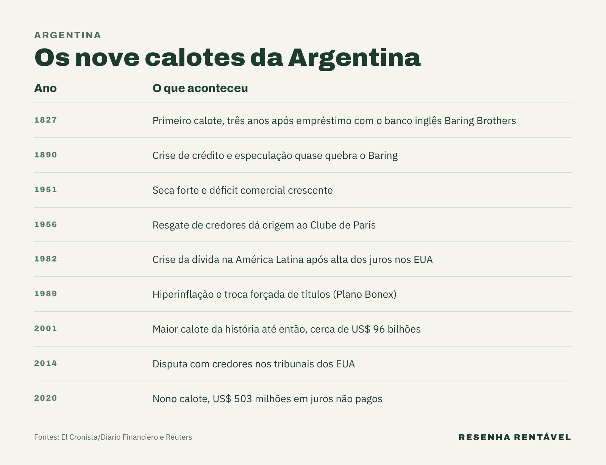

Por que a Argentina vive em crise? Na resposta mais curta, porque o país passou quase um século sem conseguir juntar três coisas ao mesmo tempo: contas públicas equilibradas, moeda confiável e regras econômicas que durem. O resultado é uma sequência de calotes, inflação alta e pacotes de resgate que se repete de geração em geração.

A pergunta volta sempre que o vizinho aparece no noticiário, e 2026 não é exceção. Segundo o INDEC, o instituto oficial de estatística do país, a inflação acumulada em 12 meses estava em 33,5% em agosto, e a pobreza subiu para 32,3% da população no primeiro semestre. Para entender esses números, é preciso voltar mais de cem anos.

## A Argentina já foi um dos países mais ricos do mundo?

Sim. De acordo com os dados do Projeto Maddison, a principal base histórica de renda por país, a Argentina estava entre as dez nações mais ricas do planeta antes da Primeira Guerra Mundial. Uma série de 2018 chegou a colocá-la em primeiro lugar em 1896; uma revisão de 2020 a deixou em sexto, segundo reportagem da [BBC News Mundo](https://www.24horas.cl/internacional/noticias-bbc/cuan-rica-llego-a-ser-realmente-argentina-y-como-y-cuando-comenzo-su-desplome-economico).

Em 1913, a renda por pessoa do argentino era de US$ 6.052 (em dólares de 2011), acima da Alemanha e da França. No mesmo ano, o Brasil tinha US$ 1.046, quase seis vezes menos. Em 2023, porém, a Argentina já aparecia na 66ª posição desse ranking, segundo a BBC. Ou seja, o país não nasceu pobre: ele ficou para trás.

## Quando começou a crise na Argentina?

Aqui os economistas discordam, e a divergência ajuda a entender o problema. Na mesma reportagem da BBC, Fausto Spotorno, da Fundación Norte y Sur, aponta a desaceleração a partir de 1930 e o primeiro governo de Perón, quando os gastos públicos subiram e a inflação apareceu, como o ponto de virada. Já defensores de Perón lembram que a Europa recebeu o Plano Marshall e a Argentina não, e que a inflação caiu para menos de 4% antes da queda do presidente, em 1955.

Outros pesquisadores colocam o início do declínio mais tarde. O historiador Ezequiel Adamovsky fala em 1975; o economista Eugenio Díaz Bonilla, da Universidade George Washington, aponta o golpe de 1976. Além disso, Rok Spruk, da Universidade de Ljubljana, destaca a instabilidade das instituições: o país teve seis golpes de Estado no século 20. Por fim, um levantamento das pesquisadoras Valeria Arza e Wendy Brau contou mais de 30 mudanças de rumo econômico entre 1955 e 2018, 16 delas radicais. Nesse período, cada ministro da Economia durou, em média, 13 meses.

## Quantas vezes a Argentina deu calote?

Foram nove calotes na dívida soberana, segundo a agência [Reuters](https://www.moneytimes.com.br/argentina-tem-9o-default-soberano-em-meio-a-intensificacao-de-negociacoes-sobre-divida/), que registrou o nono em maio de 2020, quando o país deixou de pagar cerca de US$ 503 milhões em juros. O primeiro aconteceu em 1827, três anos depois de um empréstimo de 1 milhão de libras com o banco inglês Baring Brothers. Depois vieram 1890, 1951, 1956, 1982, 1989, 2001, 2014 e 2020, de acordo com levantamento do jornal El Cronista republicado pelo [Diario Financiero](https://www.df.cl/internacional/ripe/los-ocho-defaults-que-marcaron-la-historia-argentina-y-generaron-la-fama).

O de 2001 foi o maior da história até então, com cerca de US$ 96 bilhões. Na prática, cada calote fecha as portas do crédito externo por anos. Sem crédito, o governo tende a cobrir o rombo emitindo moeda, o que alimenta a inflação. A Argentina, aliás, não está sozinha no endividamento: a [dívida pública mundial](https://resenharentavel.com/divida-publica-mundial/) bateu recorde em 2024, segundo a ONU.

## O que foi o corralito de 2001?

A Argentina saiu da hiperinflação do fim dos anos 1980, que passou de 2.600% ao ano em 1989 e 1990, segundo estudo publicado pelo FMI, com uma solução radical. Em 27 de março de 1991, a Lei de Conversibilidade, do ministro Domingo Cavallo no governo Carlos Menem, fixou 1 peso igual a 1 dólar. A inflação caiu, mas manter a paridade exigia uma entrada constante de dólares.

Em novembro de 2001, o FMI não renovou um crédito ao país, segundo o Diario Financiero, e a corrida aos bancos começou. Veio então o corralito: segundo a [CNN en Español](https://cnnespanol.cnn.com/2021/12/20/20-anos-corralito-argentina-orix), o decreto 1570/2001 entrou em vigor em 3 de dezembro de 2001 e limitou os saques a 250 pesos ou US$ 250 por semana. Em seguida, vieram protestos, saques e repressão, com 39 mortos. O presidente Fernando de la Rúa renunciou em 20 de dezembro, e o país teve três presidentes em poucas semanas. Em 2002, o governo Eduardo Duhalde acabou com a paridade, e o peso passou a valer cerca de um terço de dólar.

## Por que a Argentina depende tanto do FMI?

Porque, sem crédito no mercado, o Fundo Monetário Internacional vira o último a emprestar. Segundo a agência AFP, em texto publicado pela [Swissinfo](https://www.swissinfo.ch/spa/argentina-y-el-fmi%3A-cinco-claves-de-una-historia-recurrente/89159697) em abril de 2025, o empréstimo de US$ 57 bilhões aprovado em 2018, no governo Mauricio Macri, foi o maior da história do FMI; desse total, US$ 44 bilhões foram desembolsados. Mesmo assim, o país teve de refinanciar a dívida em 2022.

Em 2025, veio um novo acordo, de US$ 20 bilhões, o 23º entre a Argentina e o Fundo. Com isso, o país segue como o maior devedor do FMI. Enquanto isso, a inflação de 2023 fechou em 211,4%, a maior desde 1990, de acordo com o INDEC citado pelo site de checagem [Chequeado](https://chequeado.com/el-explicador/la-inflacion-de-diciembre-fue-del-255-y-cerro-el-2023-en-2114-los-valores-mas-altos-en-3-decadas/).

## Como está a crise na Argentina em 2026?

O quadro de 2026 tem dois lados. A inflação mensal caiu para 1,7% em agosto, a menor em 14 meses, segundo o INDEC. Por outro lado, o acumulado em 12 meses ainda era de 33,5%. A pobreza, por sua vez, foi de 32,3% no primeiro semestre, contra 28,2% no segundo semestre de 2025, segundo dados do INDEC publicados pela [Forbes Argentina](https://www.forbesargentina.com/today/la-pobreza-subio-323-primer-semestre-2026-afecta-casi-10-millones-personas-n98687).

A economia encolheu 0,6% no segundo trimestre, a primeira queda em dois anos, segundo a Bloomberg, em reportagem publicada pelo [InfoMoney](https://www.infomoney.com.br/mundo/economia-da-argentina-desacelera-e-ameaca-planos-de-milei-para-reeleicao-em-2027/). O governo de Javier Milei destaca o crescimento da agricultura, da energia e da mineração como sinal de que o pior passou. Já críticos, como o governador de Buenos Aires, Axel Kicillof, dizem que a política atual leva à desindustrialização. As próximas eleições presidenciais estão marcadas para outubro de 2027.

## O que a crise argentina mostra para quem vê de fora?

A história do vizinho mostra que crise econômica raramente tem uma causa só. Gastar mais do que arrecada, cobrir o buraco com emissão de moeda ou dívida e trocar de regra a cada governo forma um ciclo que se alimenta sozinho. Para o argentino comum, esse ciclo aparece no salário que perde valor e na poupança guardada em dólar. Na busca por moeda forte, o governo atual chegou a anunciar até um programa de [cidadania argentina por investimento](https://resenharentavel.com/cidadania-argentina-por-investimento/).

*Foto de capa: Gastón Cuello/Wikimedia Commons (CC BY-SA 4.0)*
