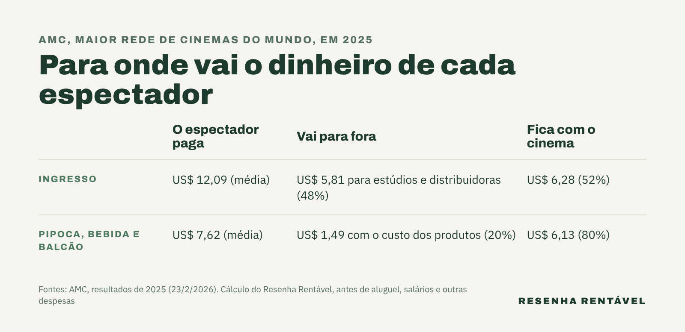

Quanto o cinema ganha com o ingresso? Nos Estados Unidos, a resposta fica perto da metade. Em 2025, a AMC, que se apresenta como a maior rede de cinemas do mundo, com cerca de 860 complexos, vendeu US$ 2,65 bilhões em ingressos e repassou US$ 1,28 bilhão aos estúdios e distribuidores, ou seja, cerca de 48%, segundo o [balanço anual da empresa](https://www.sec.gov/Archives/edgar/data/1411579/000141157926000018/amc-20260223xex99d1.htm). O resto ficou na sala, que ainda precisa pagar aluguel, funcionários e energia.

Essa conta explica uma queixa antiga de quem vai ao cinema: o preço da pipoca. Afinal, se metade do ingresso vai embora para Hollywood, o dono da sala precisa ganhar dinheiro em outro lugar. Além disso, entender essa divisão ajuda a ler as notícias de bilheteria, porque um filme que "fez US$ 1 bilhão" não colocou US$ 1 bilhão no bolso do estúdio.

## Como funciona a divisão da bilheteria?

O dinheiro do ingresso passa por três mãos. Primeiro, o espectador paga o cinema, chamado de exibidor. Depois, o exibidor repassa uma parte à distribuidora, a empresa que leva o filme até as salas e que, nos grandes lançamentos, pertence ao próprio estúdio. Por fim, a distribuidora divide o que recebeu com quem produziu e financiou o filme.

A fatia de cada um é negociada filme a filme. Em geral, a bilheteria acaba dividida mais ou menos meio a meio entre distribuidor e cinema, segundo o livro *Marketing to Moviegoers*, de Robert Marich, citado pela [Wikipédia](https://en.wikipedia.org/wiki/Film_distributor). Por isso, a fatia muda de filme para filme e, em alguns contratos, de semana para semana. Quanto mais disputado o lançamento, mais força o estúdio tem na mesa.

Quem tem o filme mais desejado do ano pode cobrar mais. Em 2017, a Disney exigiu dos cinemas americanos 65% da bilheteria de *Star Wars: Os Últimos Jedi*, além de quatro semanas na maior sala de cada complexo, segundo reportagem do Wall Street Journal citada pelo [Celluloid Junkie](https://celluloidjunkie.com/2017/11/04/disney-can-demand-65-box-office-star-wars-last-jedi/). Quem não cumprisse a regra das quatro semanas pagaria 5 pontos a mais, ou seja, 70%.

## Quanto o cinema ganha com o ingresso nos Estados Unidos?

O balanço da AMC dá a melhor fotografia do negócio, porque a empresa é listada em bolsa e precisa abrir os números. Em 2025, a rede recebeu 219,4 milhões de espectadores, e o ingresso médio custou US$ 12,09, segundo o comunicado de resultados publicado em 23 de fevereiro de 2026.

Com isso, uma conta simples mostra o tamanho da fatia. Dos US$ 12,09 de cada ingresso, cerca de US$ 5,81 foram para estúdios e distribuidoras, e US$ 6,28 ficaram com o cinema. No entanto, esse valor ainda não é lucro. Com ele, a sala paga aluguel, salários, limpeza, projetores e a conta de luz de dezenas de telas ligadas o dia inteiro.

## Por que a pipoca do cinema é tão cara?

Aqui está o segredo do negócio. Em 2025, a AMC vendeu US$ 1,67 bilhão em pipoca, refrigerante e outros itens do balcão, e gastou só US$ 327 milhões com os próprios produtos, segundo o mesmo balanço. Na prática, de cada US$ 100 vendidos no balcão, cerca de US$ 80 sobram para a empresa antes das outras despesas.

Cada espectador gastou em média US$ 7,62 no balcão. Desse valor, cerca de US$ 1,49 cobriu o custo dos produtos, e US$ 6,13 ficaram com o cinema. Assim, a pipoca rendeu à sala quase o mesmo que a sua parte do ingresso. Ninguém divide a pipoca com Hollywood, e por isso as redes investem em combos, copos colecionáveis e salas com cardápio completo.

## E no Brasil, quanto o cinema ganha com o ingresso?

No Brasil, a lógica é parecida. Segundo reportagem do g1 de 2020, reproduzida pelo [Sindicato dos Comerciários de São Paulo](https://www.comerciarios.org.br/post/28481-Acha-caro-ir-ao-cinema-Entenda-como-se-calcula-o-valor-dos-ingressos-e-a-divisao-da-bilheteria), os cinemas ficavam em média com 52,5% do ingresso, fatia que podia chegar a 60% a partir da segunda semana em cartaz.

Do valor do ingresso ainda saem o ISS, imposto municipal de 5%, e 2,5% para o Ecad, que cobra os direitos das músicas dos filmes, de acordo com a mesma reportagem. Além disso, o aluguel nos shoppings costumava ir de 5% a 15% da receita da sala, segundo o mesmo texto. Enquanto isso, o público encolheu: em 2025, os cinemas brasileiros venderam 112,8 milhões de ingressos e arrecadaram R$ 2,3 bilhões, queda de 7,6% na renda, segundo o anuário da Ancine divulgado pelo [Portal Exibidor](https://www.exibidor.com.br/noticias/mercado/15817-ancine-divulga-anuario-do-audiovisual-brasileiro-com-queda-de-publico-e-crescimento-do-parque-exibidor-em-2025). Dividindo um número pelo outro, o ingresso médio ficou perto de R$ 20.

## Quanto o estúdio de Hollywood recebe fora dos Estados Unidos?

Fora do mercado americano, a fatia do estúdio costuma ser menor. Em 2016, a Reuters informou que os estúdios estrangeiros recebiam 25% da bilheteria dos filmes importados pela China, contra uma média de cerca de 40% nos outros mercados internacionais, segundo a reportagem publicada pela [Fortune](https://www.fortune.com/2016/12/16/china-to-review-film-limits-as-box-office-growth-slows). Por isso, um sucesso enorme na China rende ao estúdio bem menos do que o mesmo valor vendido em Nova York ou Los Angeles.

## O que isso muda para quem faz filmes?

Para o produtor, a divisão muda toda a conta do sucesso. Um filme precisa arrecadar muito mais do que custou para dar lucro, porque metade da bilheteria fica nas salas e o marketing vem por fora, como mostra o ranking dos [filmes mais caros da história](https://resenharentavel.com/filmes-mais-caros-da-historia/). Por isso, os estúdios correm atrás de outras receitas, do streaming ao [product placement](https://resenharentavel.com/product-placement/), as marcas pagas para aparecer em cena.

No fim, o ingresso sustenta Hollywood e o balcão sustenta o cinema. Pelas contas da AMC, o espectador que passa no balcão vale quase o dobro para a sala do que quem compra só o ingresso. Assim, na próxima vez que a pipoca parecer cara demais, vale lembrar que ela ajuda a pagar a sala onde o filme passa.

*Foto de capa: Andreas Praefcke/Wikimedia Commons (CC BY 3.0)*
