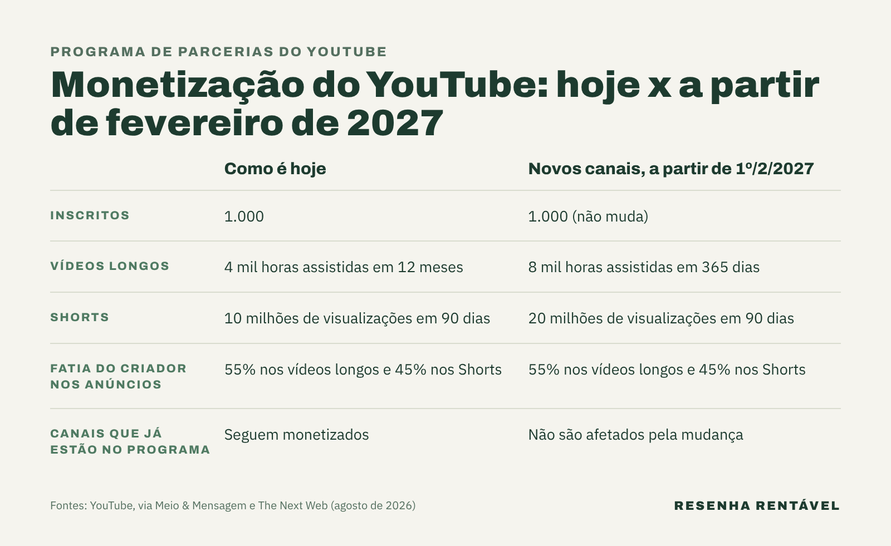

A monetização do YouTube funciona por um programa de parceria: o canal que bate as metas mínimas de público passa a receber uma parte do dinheiro dos anúncios e das assinaturas. Hoje, a porta de entrada é ter 1.000 inscritos e 4 mil horas assistidas em 12 meses. A partir de fevereiro de 2027, novos canais vão precisar do dobro de horas.

A mudança foi anunciada pelo YouTube em agosto de 2026 e mexe com quem está começando agora. Afinal, o programa já reúne mais de 3 milhões de criadores no mundo, segundo o [Meio & Mensagem](https://www.meioemensagem.com.br/midia/youtube-altera-regras-para-monetizacao-de-criadores). Além disso, o dinheiro em jogo é grande: no evento Made on YouTube de setembro de 2025, a empresa disse ter pago mais de US$ 100 bilhões a criadores, artistas e empresas de mídia em quatro anos, como registrou o [Shacknews](https://www.shacknews.com/article/145986/youtube-claim-100-billion-dollar-pay-out).

## Como funciona a monetização do YouTube hoje?

O nome oficial é Programa de Parcerias do YouTube, conhecido pela sigla em inglês YPP. Existem dois caminhos para entrar. No primeiro, o canal precisa de 1.000 inscritos e 4 mil horas de exibição pública em vídeos longos nos últimos 12 meses. No segundo, pensado para quem faz vídeos curtos, valem os mesmos 1.000 inscritos com 10 milhões de visualizações válidas no Shorts em 90 dias.

Existe também um degrau mais baixo, que não dá acesso aos anúncios. Com 500 inscritos e 3 mil horas em um ano (ou 3 milhões de visualizações no Shorts em 90 dias), o canal já libera as ferramentas de apoio dos fãs, as parcerias com marcas pela plataforma e as vendas pelo YouTube Shopping, segundo o [The Next Web](https://thenextweb.com/news/youtube-partner-program-doubles-entry-requirements-2027). Esse nível não muda em 2027.

## Quanto o YouTube paga aos criadores?

O YouTube não paga um valor fixo por visualização. Na prática, ele divide com o criador o dinheiro que entra com a publicidade. Nos vídeos longos, o criador fica com 55% da receita dos anúncios exibidos no seu conteúdo. Nos vídeos curtos, a fatia é de 45%. Nesse caso, o dinheiro dos anúncios exibidos entre um Short e outro vai para um fundo comum dos criadores, repartido entre os canais conforme as visualizações de cada um.

A outra fonte é o YouTube Premium, a assinatura sem anúncios. Segundo o Meio & Mensagem, 30% da receita líquida do Premium e 60% da receita do Premium Lite, uma versão mais barata, vão para os fundos dos criadores. O YouTube afirma que, quando um usuário assina o Premium, os parceiros ganham em média mais do que quando ele assistia com anúncios, com base no desempenho de 2026.

Por isso, dois canais com o mesmo número de visualizações podem ganhar valores muito diferentes. O resultado depende do tema, do país do público, da duração dos vídeos e de quanto os anunciantes pagam naquele mercado.

## O que muda na monetização do YouTube em 2027?

A partir de 1º de fevereiro de 2027, o caminho dos vídeos longos passa a exigir 8 mil horas de exibição nos 365 dias anteriores, e não mais 4 mil. No caminho dos Shorts, a meta sobe de 10 milhões para 20 milhões de visualizações em 90 dias. Os 1.000 inscritos continuam iguais.

Quem já está no programa não é afetado, segundo o The Next Web. Porém, há uma regra nova para os canais parados: a partir de fevereiro, o canal se mantém ativo com 1.000 horas assistidas em um ano, 1 milhão de visualizações no Shorts em 90 dias ou ao menos dois vídeos longos ou cinco Shorts publicados a cada 90 dias.

## Por que o YouTube dobrou as exigências?

O vice-presidente de produtos para criadores, Amjad Hanif, disse que os ajustes refletem o crescimento do ecossistema de criadores nos últimos anos, segundo o Meio & Mensagem. O programa foi criado há quase 20 anos e não passava por mudanças grandes desde 2018. Ao mesmo tempo, a empresa anunciou bônus para quem vende pelo YouTube Shopping e créditos de produção para parcerias com marcas.

O YouTube também diz que espera pagar mais aos criadores em 2027 do que em 2026. Ou seja, a régua sobe para quem entra, mas o bolo total deve crescer. Para quem está começando, o recado é que o tempo até o primeiro pagamento tende a ficar mais longo.

## Quanto o YouTube movimenta no Brasil?

O peso do YouTube na economia brasileira foi medido pela Oxford Economics, em parceria com a plataforma. Segundo o [relatório de impacto do YouTube](https://blog.youtube/intl/pt-br/news-and-events/relatorio-de-impacto-do-youtube-2026/), o ecossistema de criadores contribuiu com mais de R$ 6 bilhões para o PIB do país em 2025 e sustentou mais de 150 mil empregos. O mesmo estudo conta mais de 100 mil canais brasileiros com mais de 100 mil inscritos.

De acordo com a [Forbes Brasil](https://forbes.com.br/forbes-money/2026/09/youtube-brasil-impacto-economico/), o número de canais que faturam a partir de R$ 10 mil cresceu mais de 40% em um ano, e o dos que faturam a partir de R$ 100 mil, mais de 25%. A plataforma alcança 130 milhões de brasileiros por mês. Com tanta gente produzindo, vale entender também a diferença entre [influenciador e criador de conteúdo](https://resenharentavel.com/influenciador-ou-criador-de-conteudo/).

## Vale a pena tentar viver de YouTube?

Os números mostram um mercado que cresce, mas que também concentra renda. A [economia dos criadores](https://resenharentavel.com/economia-dos-criadores/) movimenta cada vez mais dinheiro, mas a renda se concentra no topo, e a classe média da internet encolhe. Além disso, os casos de topo mostram que o lucro pode vir de fora dos anúncios: os vídeos de [MrBeast](https://resenharentavel.com/mrbeast-como-ganha-dinheiro/) custam milhões, e o dinheiro grosso vem do chocolate Feastables.

Com a régua mais alta a partir de 2027, a monetização do YouTube passa a premiar ainda mais quem publica com frequência e prende a atenção por mais tempo. Os anúncios continuam sendo a porta de entrada, mas o próprio YouTube tem aberto outras fontes de renda, como as vendas pelo Shopping, o apoio dos fãs e as parcerias com marcas.

O Resenha Rentável investigou para onde está indo o dinheiro dos influenciadores. Veja o vídeo:

https://youtu.be/zRIcmLPRWwc

*Foto de capa: LocoWiki/Wikimedia Commons (CC BY-SA 4.0)*
