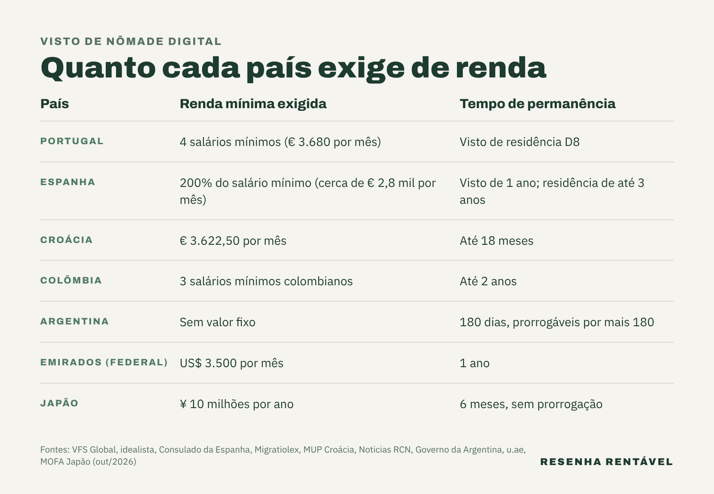

O visto de nômade digital é a autorização para morar por um tempo em outro país trabalhando a distância para empresas ou clientes de fora dele. Brasileiros podem pedir esse tipo de visto em países como Portugal, Espanha, Croácia, Japão, Colômbia, Argentina e Emirados Árabes. A principal diferença está na renda exigida, que vai de nenhum valor fixo, na Argentina, a ¥ 10 milhões por ano, no Japão.

O tema ganhou peso com a popularização do trabalho remoto, e esse público movimenta a economia por onde passa. Só em Florianópolis, um levantamento do Observatório Digital Nomads, da consultoria DashCity, contou cerca de 5.666 nômades digitais em 2025, alta de 224% sobre 2018, segundo o [Baguete](https://www.baguete.com.br/noticias/floripa-estima-ganhar-r-15-bi-com-fluxo-de-nomades-digitais). Por isso, antes de fazer as malas, vale entender o que cada destino pede.

## O que é um visto de nômade digital?

Na prática, é uma autorização de residência temporária para quem já tem trabalho fora do país de destino. Em geral, o trabalho precisa ser para empresas ou clientes de fora, e não para firmas do país de destino. Ou seja, a pessoa leva o emprego ou os clientes na bagagem e comprova que ganha o suficiente para se manter.

Cada país dá um nome diferente para esse documento. Além disso, as exigências mudam bastante: renda mínima, seguro saúde, tempo de permanência e possibilidade de renovação. Por isso, a comparação precisa ser feita país a país, e sempre conferida no consulado antes do pedido.

## Quanto Portugal exige no visto de nômade digital?

Em Portugal, o visto para atividade profissional remota, conhecido como D8, exige renda média mensal dos últimos três meses igual a quatro salários mínimos portugueses, segundo o formulário da [VFS Global](https://www.vfsglobal.com/portugal/Brazil/English/pdf/Digital-nomadas.pdf), empresa que recebe os pedidos no Brasil. Como o salário mínimo de Portugal subiu para € 920 em janeiro de 2026, de acordo com o [idealista](https://www.idealista.pt/news/node/73269), a conta dá € 3.680 por mês. Esse visto entrou em vigor em 30 de outubro de 2022, segundo o jornal português ECO.

## E na Espanha e na Croácia?

A Espanha criou o visto de teletrabalho de caráter internacional com a Lei 28/2022, a chamada Lei de Startups. O visto vale por até um ano e, dentro do país, a autorização de residência pode chegar a três anos, segundo o [consulado espanhol](https://www.exteriores.gob.es/Consulados/sydney/es/Comunicacion/Noticias/Paginas/Solicitudes-de-visados-y-autorizaciones-de-residencia-de-teletrabajo-de-car%C3%A1cter-internacional.aspx). A renda exigida é de 200% do salário mínimo espanhol, o que dá cerca de € 2,8 mil por mês em 2026, de acordo com o escritório de imigração Migratiolex.

Já a Croácia pede renda mínima de € 3.622,50 por mês, ou € 43.470 na conta para uma estadia de 12 meses, segundo o [Ministério do Interior croata](https://mup.gov.hr/aliens-281621/stay-and-work/temporary-stay-of-digital-nomads/286833). A permanência pode chegar a 18 meses. Além disso, a renda desses estrangeiros fica isenta do imposto de renda croata, segundo o site Croatia Week.

## Quais países da América Latina têm visto de nômade digital?

A Colômbia exige comprovação de renda de três salários mínimos colombianos nos últimos três meses e concede residência de até dois anos, segundo o [Noticias RCN](https://www.noticiasrcn.com/economia/visa-nomada-digital-en-colombia-que-es-cuanto-cuesta-y-como-solicitarla-465156). Além disso, quem passa mais de 183 dias no país em geral vira residente fiscal, ou seja, pode ter de declarar imposto por lá, segundo o mesmo veículo.

A Argentina tem o regime mais simples. A residência transitória de nômade digital vale por até 180 dias, prorrogáveis por igual prazo, e não exige renda mínima, apenas documentos que provem a atividade remota, segundo o [governo argentino](https://www.argentina.gob.ar/node/408747). Como o brasileiro não precisa de visto de turista para entrar no país, pode fazer o pedido já em território argentino. O vizinho também oferece outros caminhos, como a [cidadania argentina por investimento](https://resenharentavel.com/cidadania-argentina-por-investimento/).

## Japão e Dubai valem para brasileiros?

Sim, mas a régua é alta. O Japão pede renda anual de ¥ 10 milhões ou mais e seguro saúde com cobertura de pelo menos ¥ 10 milhões, segundo o [Ministério das Relações Exteriores japonês](https://www.mofa.go.jp/ca/fna/pagewe_000001_00046.html). Além disso, a estadia é de seis meses, sem prorrogação. O Brasil está entre os 51 países e regiões cujos cidadãos podem pedir esse visto, segundo a Agência de Imigração do Japão.

Nos Emirados Árabes, o visto federal de trabalho virtual exige renda de US$ 3.500 por mês e vale por um ano. Já o programa próprio de Dubai pede salário de pelo menos US$ 5.000 por mês e custa US$ 287 por pessoa, além do seguro, segundo o [portal oficial do governo dos Emirados](https://u.ae/en/information-and-services/visa-and-emirates-id/residence-visas/residence-visa-for-working-outside-the-uae).

## O Brasil também tem visto de nômade digital?

Tem, para estrangeiros que querem morar aqui. A Resolução 45 do Conselho Nacional de Imigração, publicada em 24 de janeiro de 2022, exige renda mínima de US$ 1.500 por mês ou US$ 18 mil em conta, sempre de fonte pagadora estrangeira, segundo a [Bloomberg Línea](https://www.bloomberglinea.com.br/2022/01/24/brasil-regulamenta-concessao-de-visto-para-nomade-digital/). O visto vale por um ano e pode ser prorrogado.

Esse público movimenta dinheiro. Em Florianópolis, o mesmo estudo da DashCity estimou impacto de cerca de R$ 1,5 bilhão por ano na economia local, com gastos em hospedagem, coworking e alimentação, segundo o Baguete.

Em resumo, o visto de nômade digital é o caminho mais direto para trabalhar de outro país sem depender de uma empresa local. Portugal, Espanha e Croácia pedem algo entre € 2,8 mil e € 3,7 mil por mês, a Argentina não fixa renda e o Japão tem a régua mais alta da lista. Como as regras mudam com frequência, o pedido deve ser conferido no consulado do país escolhido, e quem ainda está escolhendo o destino pode comparar o custo de vida nas [cidades mais caras do mundo](https://resenharentavel.com/cidades-mais-caras-do-mundo/).

*Foto de capa: AbhiSuryawanshi/Wikimedia Commons (CC BY-SA 4.0)*
